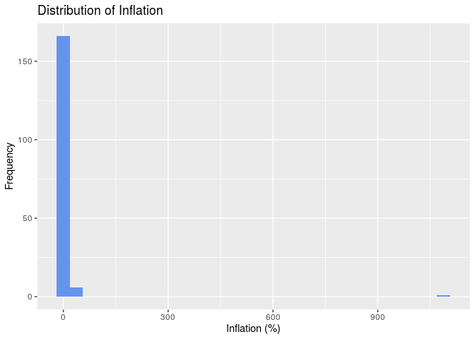
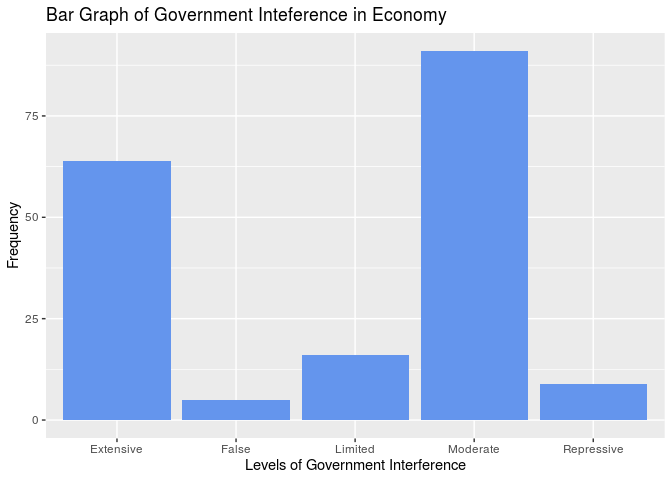
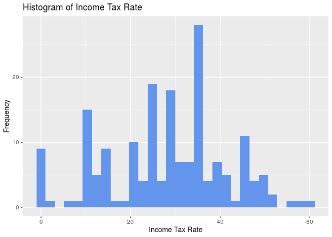

PROJECT TITLE
================
NAME HERE
2019/10/26

``` r
library(tidyverse)
```

<<<<<<< HEAD
    ## ── Attaching packages ──────────────────────────────────────────────────────────── tidyverse 1.2.1 ──
=======
    ## ── Attaching packages ─────────────────────────────────────────────────────────────── tidyverse 1.2.1 ──
>>>>>>> 038baa78673a7a531d9c9d0ae293ed989df5e51b

    ## ✔ ggplot2 3.2.1     ✔ purrr   0.3.2
    ## ✔ tibble  2.1.3     ✔ dplyr   0.8.3
    ## ✔ tidyr   0.8.3     ✔ stringr 1.4.0
    ## ✔ readr   1.3.1     ✔ forcats 0.4.0

<<<<<<< HEAD
    ## ── Conflicts ─────────────────────────────────────────────────────────────── tidyverse_conflicts() ──
=======
    ## ── Conflicts ────────────────────────────────────────────────────────────────── tidyverse_conflicts() ──
>>>>>>> 038baa78673a7a531d9c9d0ae293ed989df5e51b
    ## ✖ dplyr::filter() masks stats::filter()
    ## ✖ dplyr::lag()    masks stats::lag()

``` r
library(readxl)
```

``` r
setwd("/cloud/project")
<<<<<<< HEAD
economic_data <- read_excel("02-data/economic_data.xlsx", 
    col_types = c("text", "text", "text", 
        "numeric", "numeric", "numeric", 
        "numeric", "numeric", "numeric", 
        "numeric", "numeric", "numeric", 
        "numeric", "numeric", "numeric"))
=======
economic_data <- read_excel("02-data/economic_data.xlsx",
col_types = c("text", "text", "text",
"numeric", "numeric", "numeric",
"numeric", "numeric", "numeric",
"numeric", "numeric", "numeric",
"numeric", "numeric", "numeric"))
>>>>>>> 038baa78673a7a531d9c9d0ae293ed989df5e51b
```

    ## Warning in read_fun(path = enc2native(normalizePath(path)), sheet_i =
    ## sheet, : Expecting numeric in M49 / R49C13: got 'N/A'

    ## Warning in read_fun(path = enc2native(normalizePath(path)), sheet_i =
    ## sheet, : Expecting numeric in D80 / R80C4: got 'N/A'

    ## Warning in read_fun(path = enc2native(normalizePath(path)), sheet_i =
    ## sheet, : Expecting numeric in G80 / R80C7: got 'N/A'

    ## Warning in read_fun(path = enc2native(normalizePath(path)), sheet_i =
    ## sheet, : Expecting numeric in M89 / R89C13: got 'N/A'

    ## Warning in read_fun(path = enc2native(normalizePath(path)), sheet_i =
    ## sheet, : Expecting numeric in E90 / R90C5: got 'N/A'

    ## Warning in read_fun(path = enc2native(normalizePath(path)), sheet_i =
    ## sheet, : Expecting numeric in F90 / R90C6: got 'N/A'

    ## Warning in read_fun(path = enc2native(normalizePath(path)), sheet_i =
    ## sheet, : Expecting numeric in G90 / R90C7: got 'N/A'

    ## Warning in read_fun(path = enc2native(normalizePath(path)), sheet_i =
    ## sheet, : Expecting numeric in J90 / R90C10: got '$40.0 (2015 est.)'

    ## Warning in read_fun(path = enc2native(normalizePath(path)), sheet_i =
    ## sheet, : Expecting numeric in L90 / R90C12: got '$1,700 (2015 est.)'

    ## Warning in read_fun(path = enc2native(normalizePath(path)), sheet_i =
    ## sheet, : Expecting numeric in N90 / R90C14: got 'N/A'

    ## Warning in read_fun(path = enc2native(normalizePath(path)), sheet_i =
    ## sheet, : Expecting numeric in O90 / R90C15: got 'N/A'

    ## Warning in read_fun(path = enc2native(normalizePath(path)), sheet_i =
    ## sheet, : Expecting numeric in M92 / R92C13: got 'N/A'

    ## Warning in read_fun(path = enc2native(normalizePath(path)), sheet_i =
    ## sheet, : Expecting numeric in D100 / R100C4: got 'N/A'

    ## Warning in read_fun(path = enc2native(normalizePath(path)), sheet_i =
    ## sheet, : Expecting numeric in G100 / R100C7: got 'N/A'

    ## Warning in read_fun(path = enc2native(normalizePath(path)), sheet_i =
    ## sheet, : Expecting numeric in D101 / R101C4: got 'N/A'

    ## Warning in read_fun(path = enc2native(normalizePath(path)), sheet_i =
    ## sheet, : Expecting numeric in G101 / R101C7: got 'N/A'

    ## Warning in read_fun(path = enc2native(normalizePath(path)), sheet_i =
    ## sheet, : Expecting numeric in H101 / R101C8: got 'N/A'

    ## Warning in read_fun(path = enc2native(normalizePath(path)), sheet_i =
    ## sheet, : Expecting numeric in I101 / R101C9: got '38,000 ppl.'

    ## Warning in read_fun(path = enc2native(normalizePath(path)), sheet_i =
    ## sheet, : Expecting numeric in J101 / R101C10: got '$6.1 CHF (2014 )'

    ## Warning in read_fun(path = enc2native(normalizePath(path)), sheet_i =
    ## sheet, : Expecting numeric in K101 / R101C11: got 'N/A'

    ## Warning in read_fun(path = enc2native(normalizePath(path)), sheet_i =
    ## sheet, : Expecting numeric in L101 / R101C12: got '$139,100 (2009 est.)'

    ## Warning in read_fun(path = enc2native(normalizePath(path)), sheet_i =
    ## sheet, : Expecting numeric in M101 / R101C13: got '2.1 (2016)'

    ## Warning in read_fun(path = enc2native(normalizePath(path)), sheet_i =
    ## sheet, : Expecting numeric in N101 / R101C14: got 'N/A'

    ## Warning in read_fun(path = enc2native(normalizePath(path)), sheet_i =
    ## sheet, : Expecting numeric in O101 / R101C15: got 'N/A'

    ## Warning in read_fun(path = enc2native(normalizePath(path)), sheet_i =
    ## sheet, : Expecting numeric in M115 / R115C13: got 'N/A'

    ## Warning in read_fun(path = enc2native(normalizePath(path)), sheet_i =
    ## sheet, : Expecting numeric in M148 / R148C13: got 'N/A'

    ## Warning in read_fun(path = enc2native(normalizePath(path)), sheet_i =
    ## sheet, : Expecting numeric in D154 / R154C4: got 'N/A'

    ## Warning in read_fun(path = enc2native(normalizePath(path)), sheet_i =
    ## sheet, : Expecting numeric in E154 / R154C5: got 'N/A'

    ## Warning in read_fun(path = enc2native(normalizePath(path)), sheet_i =
    ## sheet, : Expecting numeric in F154 / R154C6: got 'N/A'

    ## Warning in read_fun(path = enc2native(normalizePath(path)), sheet_i =
    ## sheet, : Expecting numeric in G154 / R154C7: got 'N/A'

    ## Warning in read_fun(path = enc2native(normalizePath(path)), sheet_i =
    ## sheet, : Expecting numeric in H154 / R154C8: got 'N/A'

    ## Warning in read_fun(path = enc2native(normalizePath(path)), sheet_i =
    ## sheet, : Expecting numeric in L154 / R154C12: got 'N/A'

    ## Warning in read_fun(path = enc2native(normalizePath(path)), sheet_i =
    ## sheet, : Expecting numeric in N154 / R154C14: got 'N/A'

    ## Warning in read_fun(path = enc2native(normalizePath(path)), sheet_i =
    ## sheet, : Expecting numeric in O154 / R154C15: got 'N/A'

    ## Warning in read_fun(path = enc2native(normalizePath(path)), sheet_i =
    ## sheet, : Expecting numeric in G162 / R162C7: got 'N/A'

    ## Warning in read_fun(path = enc2native(normalizePath(path)), sheet_i =
    ## sheet, : Expecting numeric in H162 / R162C8: got 'N/A'

    ## Warning in read_fun(path = enc2native(normalizePath(path)), sheet_i =
    ## sheet, : Expecting numeric in J162 / R162C10: got 'N/A'

    ## Warning in read_fun(path = enc2native(normalizePath(path)), sheet_i =
    ## sheet, : Expecting numeric in K162 / R162C11: got 'N/A'

    ## Warning in read_fun(path = enc2native(normalizePath(path)), sheet_i =
    ## sheet, : Expecting numeric in L162 / R162C12: got 'N/A'

    ## Warning in read_fun(path = enc2native(normalizePath(path)), sheet_i =
    ## sheet, : Expecting numeric in N162 / R162C14: got 'N/A'

    ## Warning in read_fun(path = enc2native(normalizePath(path)), sheet_i =
    ## sheet, : Expecting numeric in O162 / R162C15: got 'N/A'

    ## Warning in read_fun(path = enc2native(normalizePath(path)), sheet_i =
    ## sheet, : Expecting numeric in E184 / R184C5: got 'N/A'

    ## Warning in read_fun(path = enc2native(normalizePath(path)), sheet_i =
    ## sheet, : Expecting numeric in F184 / R184C6: got 'N/A'

    ## Warning in read_fun(path = enc2native(normalizePath(path)), sheet_i =
    ## sheet, : Expecting numeric in G184 / R184C7: got 'N/A'

    ## Warning in read_fun(path = enc2native(normalizePath(path)), sheet_i =
    ## sheet, : Expecting numeric in H184 / R184C8: got 'N/A'

``` r
happiness_data <- read_excel("02-data/happiness_data.xlsx")

country_data <- full_join(economic_data, happiness_data, by = "Country")
country_data
```

    ## # A tibble: 193 x 16
    ##    Country Region GovInterference TariffRate IncomeTaxRate CorporateTaxRate
    ##    <chr>   <chr>  <chr>                <dbl>         <dbl>            <dbl>
    ##  1 Afghan… Asia-… Repressive             7              20               20
    ##  2 Albania Europe Moderate               1.1            23               15
    ##  3 Algeria Middl… Extensive              8.8            35               23
    ##  4 Angola  Sub-S… Extensive              9.4            17               30
    ##  5 Argent… Ameri… Moderate               7.5            35               30
    ##  6 Armenia Europe Moderate               2.1            26               20
    ##  7 Austra… Asia-… Limited                1.2            45               30
    ##  8 Austria Europe Moderate               2              50               25
    ##  9 Azerba… Asia-… Moderate               5.2            25               20
    ## 10 Bahamas Ameri… Moderate              18.6             0                0
    ## # … with 183 more rows, and 10 more variables: TaxBurden <dbl>,
    ## #   GovSpending <dbl>, Population <dbl>, GDP <dbl>, GDPGrowth <dbl>,
    ## #   GDPperCap <dbl>, Unemployment <dbl>, Inflation <dbl>,
    ## #   PublicDebt <dbl>, Happiness_Score <dbl>

## Section 1. Introduction

<<<<<<< HEAD
=======
## Section 2. Regression Analysis

>>>>>>> 038baa78673a7a531d9c9d0ae293ed989df5e51b
``` r
glimpse(country_data)
```

    ## Observations: 193
    ## Variables: 16
    ## $ Country          <chr> "Afghanistan", "Albania", "Algeria", "Angola", …
    ## $ Region           <chr> "Asia-Pacific", "Europe", "Middle East and Nort…
    ## $ GovInterference  <chr> "Repressive", "Moderate", "Extensive", "Extensi…
    ## $ TariffRate       <dbl> 7.0, 1.1, 8.8, 9.4, 7.5, 2.1, 1.2, 2.0, 5.2, 18…
    ## $ IncomeTaxRate    <dbl> 20.0, 23.0, 35.0, 17.0, 35.0, 26.0, 45.0, 50.0,…
    ## $ CorporateTaxRate <dbl> 20.0, 15.0, 23.0, 30.0, 30.0, 20.0, 30.0, 25.0,…
    ## $ TaxBurden        <dbl> 5.0, 24.9, 24.5, 20.6, 30.8, 21.3, 28.2, 42.7, …
    ## $ GovSpending      <dbl> 25.6, 29.5, 41.4, 25.3, 41.0, 26.4, 36.5, 50.2,…
    ## $ Population       <dbl> 35.5, 2.9, 41.5, 28.2, 44.1, 3.0, 24.8, 8.8, 9.…
    ## $ GDP              <dbl> 69.6, 36.0, 632.9, 190.3, 920.2, 28.3, 1246.5, …
    ## $ GDPGrowth        <dbl> 2.5, 3.9, 2.0, 0.7, 2.9, 7.5, 2.3, 2.9, 0.1, 1.…
    ## $ GDPperCap        <dbl> 1958, 12507, 15237, 6753, 20876, 9456, 50334, 4…
    ## $ Unemployment     <dbl> 8.8, 13.9, 10.0, 8.2, 8.7, 18.2, 5.6, 5.5, 5.0,…
    ## $ Inflation        <dbl> 5.0, 2.0, 5.6, 31.7, 25.7, 0.9, 2.0, 2.2, 13.0,…
    ## $ PublicDebt       <dbl> 7.3, 71.2, 25.8, 65.3, 52.6, 53.5, 41.6, 78.8, …
    ## $ Happiness_Score  <dbl> 37.94, 46.44, 58.72, 37.95, 65.99, 43.76, 72.84…

We first take an overview of the data. We can see that there are 193
observations — one observation corresponds to one country, and 16
variables, including country name, 14 predictor variables and one
<<<<<<< HEAD
response variable that we want to predict, the happiness
score.

## Section 2. Regression Analysis

``` r
aggregate(cbind(count = Region) ~ Region, data = economic_data, FUN = function(x){NROW(x)})
```

    ##                         Region count
    ## 1                     Americas    32
    ## 2                 Asia-Pacific    43
    ## 3                       Europe    45
    ## 4 Middle East and North Africa    18
    ## 5           Sub-Saharan Africa    47

``` r
regional = data.frame("Region" = c("Americas","Asia-Pacific","Europe","Middle East and North Africa","Sub-Saharan Africa"), "share" = c(32, 43, 45, 18, 47))
mycols <- c("#0073C2FF", "#EFC000FF", "#868686FF", "#CD534CFF", "#99D492")
ggplot(mapping = aes(x = "", y = share, fill = Region), data = regional) +
    geom_bar(stat = "identity", color = "white") +
    coord_polar("y", start = 0) +
    scale_fill_manual(values = mycols) +
    theme_void()
```

<!-- -->
=======
response variable that we want to predict, the happiness score.

``` r
ggplot(data = country_data, mapping = aes(x = TaxBurden)) +
  geom_histogram() + 
  labs(x = "Tax Burden (% of Country's GDP)",
       y = "Frequency",
       title = "Distribution of Tax Burden")
```

    ## `stat_bin()` using `bins = 30`. Pick better value with `binwidth`.

    ## Warning: Removed 15 rows containing non-finite values (stat_bin).

<!-- -->

``` r
ggplot(data = country_data, mapping = aes(x = GovSpending)) +
  geom_histogram(binwidth = 4) + 
  labs(x = "Government Spending (% of Country's GDP)",
       y = "Frequency",
       title = "Distribution of Government Spending")
```

    ## Warning: Removed 12 rows containing non-finite values (stat_bin).

<!-- -->

``` r
ggplot(data = country_data, mapping = aes(x = Population)) +
  geom_histogram(binwidth = 40) + 
  labs(x = "Population (Million)",
       y = "Frequency",
       title = "Distribution of Population")
```

    ## Warning: Removed 9 rows containing non-finite values (stat_bin).

<!-- -->

``` r
ggplot(data = country_data, mapping = aes(x = Unemployment)) +
  geom_histogram(binwidth = 1) + 
  labs(x = "Unemployment (%)",
       y = "Frequency",
       title = "Distribution of Unemployment")
```

    ## Warning: Removed 14 rows containing non-finite values (stat_bin).

<!-- -->

``` r
ggplot(data = country_data, mapping = aes(x = Inflation)) +
  geom_histogram() + 
  labs(x = "Inflation (%)",
       y = "Frequency",
       title = "Distribution of Inflation")
```

    ## `stat_bin()` using `bins = 30`. Pick better value with `binwidth`.

    ## Warning: Removed 12 rows containing non-finite values (stat_bin).

<!-- -->
>>>>>>> 038baa78673a7a531d9c9d0ae293ed989df5e51b

``` r
ggplot(mapping = aes(x = GovInterference), data = economic_data) +
geom_bar(fill = "cornflowerblue") +
labs(title = "Bar Graph of Government Inteference in Economy", x  = "Levels of Government Interference", y = "Frequency")
```

<!-- -->

``` r
ggplot(mapping = aes(x = TariffRate), data = economic_data) +
geom_histogram(fill = "cornflowerblue") +
labs(title = "Histogram of Tariff Rate", x  = "Tariff Rate", y = "Frequency")
```

    ## `stat_bin()` using `bins = 30`. Pick better value with `binwidth`.

    ## Warning: Removed 4 rows containing non-finite values (stat_bin).

<!-- -->

``` r
ggplot(mapping = aes(x = IncomeTaxRate), data = economic_data) +
geom_histogram(fill = "cornflowerblue") +
labs(title = "Histogram of Income Tax Rate", x  = "Income Tax Rate", y = "Frequency")
```

    ## `stat_bin()` using `bins = 30`. Pick better value with `binwidth`.

    ## Warning: Removed 3 rows containing non-finite values (stat_bin).

<!-- -->

``` r
ggplot(mapping = aes(x = CorporateTaxRate), data = economic_data) +
geom_histogram(fill = "cornflowerblue") +
labs(title = "Histogram of Corporate Tax Rate", x  = "Corporate Tax Rate", y = "Frequency")
```

    ## `stat_bin()` using `bins = 30`. Pick better value with `binwidth`.

    ## Warning: Removed 3 rows containing non-finite values (stat_bin).

<<<<<<< HEAD
<!-- -->
=======
<!-- -->

``` r
country_data_temp <- country_data %>% select(Inflation) %>% filter(Inflation < 100)
ggplot(data = country_data_temp, mapping = aes(x = Inflation)) +
  geom_histogram(binwidth = 1) + 
  labs(x = "Inflation (%)",
       y = "Frequency",
       title = "Distribution of Inflation without Outlier")
```

<!-- -->

``` r
ggplot(data = country_data, mapping = aes(x = PublicDebt)) +
  geom_histogram(binwidth = 8) + 
  labs(x = "Public Debt (% of GDP)",
       y = "Frequency",
       title = "Distribution of Public Debt")
```

    ## Warning: Removed 12 rows containing non-finite values (stat_bin).

<!-- -->
>>>>>>> 038baa78673a7a531d9c9d0ae293ed989df5e51b

## Section 3. Regression Analysis Plan

## Section 4. References

## The Data
