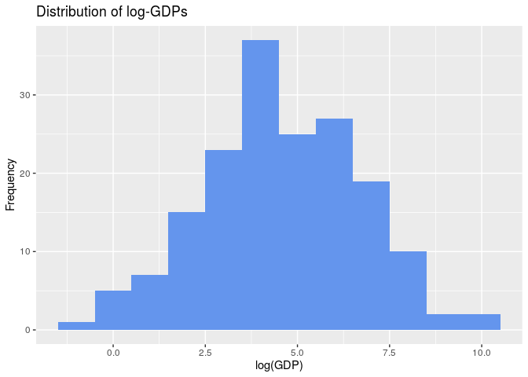

What makes a country economically great?
================
Rtists
2019/10/26

``` r
library(tidyverse)
```

    ## ── Attaching packages ─────────────────────────────────────────────────────────────────── tidyverse 1.2.1 ──

    ## ✔ ggplot2 3.2.1     ✔ purrr   0.3.2
    ## ✔ tibble  2.1.3     ✔ dplyr   0.8.3
    ## ✔ tidyr   0.8.3     ✔ stringr 1.4.0
    ## ✔ readr   1.3.1     ✔ forcats 0.4.0

    ## ── Conflicts ────────────────────────────────────────────────────────────────────── tidyverse_conflicts() ──
    ## ✖ dplyr::filter() masks stats::filter()
    ## ✖ dplyr::lag()    masks stats::lag()

``` r
library(readxl)
library(skimr)
```

    ## 
    ## Attaching package: 'skimr'

    ## The following object is masked from 'package:stats':
    ## 
    ##     filter

``` r
economic_data <- read_excel("/cloud/project/02-data/economic_data.xlsx",
col_types = c("text", "text", "text",
"numeric", "numeric", "numeric",
"numeric", "numeric", "numeric",
"numeric", "numeric", "numeric",
"numeric", "numeric", "numeric"))
```

## Section 1. Introduction

GDP is a measure of the total market value of all goods and services
produced within a country over a period of time. Consequently, a high
GDP implies that a country has significant economic influence. As
emerging markets continue to industrialize, the question of how one
achieves a larger GDP is becoming a critical one in policy selection;
failure to design policies that encourage GDP growth can cause
widespread suffering for a country’s population. Consider the case of
Venezuela, where GDP-friendly policies were shunned and massive unrest
appeared as a nearly direct consequence. In order to avoid this fate,
nations must analyze which economic sectors are most influential on GDP
in order to create guiding policies.

The use of multiple linear regression in the study of GDP and GDP growth
is not novel. The approach has been widely employed by economists. For
instance, Anghelache et. al has employed multiple linear regression
model in analyzing the influence of final consumption and gross
investment on Romania’s GDP over time. Urrutia et. al, on the other
hand, modeled Philippines’s real GDP using multiple linear regression
techniques. (Refer to citation of articles in the Citation section)

In this project, we will address the research question of what
predictors are most useful in predicting GDP and to what extent GDP can
be predicted successfully; we expect that factors such as population,
inflation, GovInterference, and TaxBurden will most effectively predict
GDP. The predictor variables used in our analysis are used in the
calculation of the annual Economic Freedom Index. These predictors are
not traditionally used in the multiple linear regression of GDP and we
are interested to know the composite strength of these particular
predictor variables. If we can get a better understanding of how these
economic indicators correlate to GDP, it could provide policy makers and
economists with a path towards sound governmental decisions.

We hypothesize that out of the predictors in our dataset,
`GovInterference` and both measures of `TaxRate` will have a very strong
correlation with the GDP of the country, because they both reflect not
only the government’s economic policy but often times the government’s
approach to the macroecononmy. We predict that as government
interference increases, GDP declines, and as tax rates increase, GDP
declines as well.

## Section 2. Regression Analysis

From the glimpse of the data in the Data Section, we know that there are
193 observations. Each observation corresponds to one country has 15
variables providing information about it, including country name and 14
predictor variables that are economic and demographic indicators about
the country. The data also contains the response variable that we want
to predict, GDP. This response variable is a numeric and continuous
variable that is in the billions of US dollars.

The data was collected by the World Economic Freedom Index, an
organization that provides information and data about the economic
health of countries and is used by policy makers to motivate their
economic policy decisions.

Before looking at each of the predictor variables, we would like to
ensure that the data is cleaned and error-free. We will remove
observations that have missing information, such as countries like Iraq,
Syria, North Korea, and others that have very little outside
involvement. Additionally, we would like to remove the `GDPperCap`
variable from the dataset, as it is simply the GDP divided by the
population, both values we have as separate variables in the dataset, as
to prevent potential future issues of multicolinearity.

``` r
economic_data <- na.omit(economic_data)
economic_data$GDPperCap = NULL
```

Now that our data set is ready to explore, let’s begin by looking at the
distribution of GDP’s of countries in our data set.

#### Response Variable

``` r
ggplot(data = economic_data, mapping = aes(x = GDP)) +
  geom_histogram(binwidth = 1000, fill = "cornflowerblue") +
  labs(x = "GDP (billions of USD)",
       y = "Frequency",
       title = "Distribution of GDPs")
```

<!-- -->

``` r
economic_data %>%
select(GDP) %>%
skim()
```

    ## Skim summary statistics
    ##  n obs: 173 
    ##  n variables: 1 
    ## 
    ## ── Variable type:numeric ───────────────────────────────────────────────────────────────────────────────────
    ##  variable missing complete   n   mean      sd  p0  p25  p50   p75    p100
    ##       GDP       0      173 173 729.71 2486.04 0.6 28.3 88.9 439.6 23159.1
    ##      hist
    ##  ▇▁▁▁▁▁▁▁

The distribution of GDP shows significant right skew, which is
reasonable as the world has countries such as the US and China with
significantly greater GDP’s than the average country. Because of the
extreme outliers in population, we will plot another graph of GDP
without the outliers to better show the distribution of most other data
points.

``` r
economic_data_temp <- economic_data %>% select(GDP) %>% filter(GDP < 3000)

ggplot(data = economic_data_temp, mapping = aes(x = GDP)) +
  geom_histogram(fill = "cornflowerblue") +
  labs(x = "GDP (billions of USD)",
       y = "Frequency",
       title = "Distribution of GDPs")
```

    ## `stat_bin()` using `bins = 30`. Pick better value with `binwidth`.

<!-- -->

``` r
economic_data %>%
select(GDP) %>%
skim()
```

    ## Skim summary statistics
    ##  n obs: 173 
    ##  n variables: 1 
    ## 
    ## ── Variable type:numeric ───────────────────────────────────────────────────────────────────────────────────
    ##  variable missing complete   n   mean      sd  p0  p25  p50   p75    p100
    ##       GDP       0      173 173 729.71 2486.04 0.6 28.3 88.9 439.6 23159.1
    ##      hist
    ##  ▇▁▁▁▁▁▁▁

The distribution of GDP is unimodal and right-skewed. Since the media
and interquartile range are less influenced by outliers, we report them
as measures of center and spread. The median of the distribution is 88.9
and the interquartile range is 411.3. THe values are in billions of
dollars.

This calls for a log-transform of the response variable, whose
distribution is visualized below:

``` r
ggplot(data = economic_data, mapping = aes(x = log(GDP))) +
  geom_histogram(binwidth = 1, fill = "cornflowerblue") +
  labs(x = "log(GDP)",
       y = "Frequency",
       title = "Distribution of log-GDPs")
```

<!-- -->

``` r
economic_data <- economic_data %>%
  mutate(logGDP = log(GDP))

economic_data %>%
select(logGDP) %>%
skim()
```

    ## Skim summary statistics
    ##  n obs: 173 
    ##  n variables: 1 
    ## 
    ## ── Variable type:numeric ───────────────────────────────────────────────────────────────────────────────────
    ##  variable missing complete   n mean   sd    p0  p25  p50  p75  p100
    ##    logGDP       0      173 173 4.61 2.08 -0.51 3.34 4.49 6.09 10.05
    ##      hist
    ##  ▁▃▅▇▆▅▂▁

This distribution of logGDP is normal and unimodal. We will likely use
this as our response variable. Since there is minimal skewing and the
distribution is generally symmetric, we report the mean and standard
deviation as measures of center and spread. THe mean logGDP is 4.61 and
the standard deviation of its distribution is 2.08.

#### Predictor Variable

We will now look at each of the 12 predictor variables that we will use
to predict GDP, starting with `TaxBurden`.

``` r
ggplot(data = economic_data, mapping = aes(x = TaxBurden)) +
  geom_histogram(binwidth = 2, fill = "cornflowerblue") + 
  labs(x = "Tax Burden (% of Country's GDP)",
       y = "Frequency",
       title = "Distribution of Tax Burden")
```

<!-- -->

``` r
economic_data %>%
select(TaxBurden) %>%
skim()
```

    ## Skim summary statistics
    ##  n obs: 173 
    ##  n variables: 1 
    ## 
    ## ── Variable type:numeric ───────────────────────────────────────────────────────────────────────────────────
    ##   variable missing complete   n  mean    sd  p0 p25  p50  p75 p100
    ##  TaxBurden       0      173 173 22.19 10.25 1.6  14 20.7 30.2   47
    ##      hist
    ##  ▂▅▇▆▅▅▂▂

`TaxBurden` represents the amount of tax paid by the citizens of a
country as a proportion of the GDP of that country. The distribution of
tax burden is unimodal and only slightly right skewed. The mode is
around 14-15%. In general, the tax burden across countries appear
normally distributed. The mean tax burden is 22.19 and the standard
deviation of the distribution is 10.17.

``` r
ggplot(data = economic_data, mapping = aes(x = GovSpending)) +
  geom_histogram(binwidth = 3, fill = "cornflowerblue") + 
  labs(x = "Government Spending (% of Country's GDP)",
       y = "Frequency",
       title = "Distribution of Government Spending")
```

<!-- -->

``` r
economic_data %>%
select(GovSpending) %>%
skim()
```

    ## Skim summary statistics
    ##  n obs: 173 
    ##  n variables: 1 
    ## 
    ## ── Variable type:numeric ───────────────────────────────────────────────────────────────────────────────────
    ##     variable missing complete   n mean    sd   p0  p25  p50  p75 p100
    ##  GovSpending       0      173 173 32.2 10.67 10.6 23.6 31.6 39.8 64.2
    ##      hist
    ##  ▂▇▇▇▇▃▁▁

`GovSpending` represents the amount spent by the government as a
percentage of the GDP of the country. The distribution of government
spending is generally symmmetric and unimodal. There are several
outliers which have significantly higher government spending: with
government spending either equal to or more than 100% of the country’s
GDP. The mode of the distribution is around 25%. Since there is minimal
skewing, we report the mean and standard deviation. The mean government
spending is 33.87 and the distribution has a standard deviation of
15.52.

``` r
ggplot(data = economic_data, mapping = aes(x = Population)) +
  geom_histogram(binwidth = 40, fill = "cornflowerblue") + 
  labs(x = "Population (Million)",
       y = "Frequency",
       title = "Distribution of Population")
```

<!-- -->

``` r
economic_data %>%
select(Population) %>%
skim()
```

    ## Skim summary statistics
    ##  n obs: 173 
    ##  n variables: 1 
    ## 
    ## ── Variable type:numeric ───────────────────────────────────────────────────────────────────────────────────
    ##    variable missing complete   n  mean     sd  p0 p25 p50  p75   p100
    ##  Population       0      173 173 42.16 149.89 0.1 2.9 9.5 31.4 1390.1
    ##      hist
    ##  ▇▁▁▁▁▁▁▁

`Population` represents the number of individuals living in a country.
The distribution of population is unimodal and right-skewed. Because
there are two extreme outliers in population, we will plot another graph
of population without these two outliers
below.

``` r
economic_data_temp <- economic_data %>% select(Population) %>% filter(Population < 500)

ggplot(data = economic_data_temp, mapping = aes(x = Population)) +
  geom_histogram(binwidth = 10, fill = "cornflowerblue") + 
  labs(x = "Population (Million)",
       y = "Frequency",
       title = "Distribution of Population")
```

<!-- -->

``` r
economic_data %>%
select(Population) %>%
skim()
```

    ## Skim summary statistics
    ##  n obs: 173 
    ##  n variables: 1 
    ## 
    ## ── Variable type:numeric ───────────────────────────────────────────────────────────────────────────────────
    ##    variable missing complete   n  mean     sd  p0 p25 p50  p75   p100
    ##  Population       0      173 173 42.16 149.89 0.1 2.9 9.5 31.4 1390.1
    ##      hist
    ##  ▇▁▁▁▁▁▁▁

The distribution of population is unimodal and right-skewed. The mode of
the distribution is around 1 million. Since the median and IQR are more
robust to skewing, we report them instead as a measures of center and
spread. The median is 9.15 and the IQR is 26.85. Additionally, when
conducting our analysis, we may need to apply a log-transform to make
the distribution of the variable more normal.

``` r
ggplot(data = economic_data, mapping = aes(x = Unemployment)) +
  geom_histogram(binwidth = 1, fill = "cornflowerblue") + 
  labs(x = "Unemployment (%)",
       y = "Frequency",
       title = "Distribution of Unemployment")
```

<!-- -->

``` r
economic_data %>%
select(Unemployment) %>%
skim()
```

    ## Skim summary statistics
    ##  n obs: 173 
    ##  n variables: 1 
    ## 
    ## ── Variable type:numeric ───────────────────────────────────────────────────────────────────────────────────
    ##      variable missing complete   n mean   sd  p0 p25 p50 p75 p100     hist
    ##  Unemployment       0      173 173 7.27 5.67 0.1 3.7 5.5 9.3 27.3 ▆▇▅▂▁▁▁▁

`Unemployment` represents the percantage of the workforce of a country
that is currently not working. The distribution of unemployment is
unimodal and right-skewed. The mode of the distribution is around 4-5%.
Since the median and IQR are more robust to skewing, we report them
instead as a measures of center and spread. The median is 5.7 and the
IQR is 5.6.

``` r
ggplot(data = economic_data, mapping = aes(x = Inflation)) +
  geom_histogram(fill = "cornflowerblue") + 
  labs(x = "Inflation (%)",
       y = "Frequency",
       title = "Distribution of Inflation")
```

    ## `stat_bin()` using `bins = 30`. Pick better value with `binwidth`.

<!-- -->

``` r
economic_data_temp <- economic_data %>% select(Inflation) %>% filter(Inflation < 100)
ggplot(data = economic_data_temp, mapping = aes(x = Inflation)) +
  geom_histogram(binwidth = 1, fill = "cornflowerblue") + 
  labs(x = "Inflation (%)",
       y = "Frequency",
       title = "Distribution of Inflation without Outlier")
```

<!-- -->

``` r
economic_data %>%
select(Inflation) %>%
skim()
```

    ## Skim summary statistics
    ##  n obs: 173 
    ##  n variables: 1 
    ## 
    ## ── Variable type:numeric ───────────────────────────────────────────────────────────────────────────────────
    ##   variable missing complete   n  mean    sd   p0 p25 p50 p75   p100
    ##  Inflation       0      173 173 10.87 82.56 -0.9 1.3 2.8 5.5 1087.5
    ##      hist
    ##  ▇▁▁▁▁▁▁▁

`Inflation` represents the change in prices of goods and services in a
year in the country. The first distribution of inflation rates includes
all outliers. Because of the size and resolution of the diagram, the
distribution of most economies are not visible. The second diagram shows
the distribution of inflation rates without the outlier with more than
1000% inflation. The distribution of inflation rate is generally
unimodal and right skewed. The mode of the distribution is around 2%.
Given significant skewing, we report the median and IQR as measures of
center and spread. The median inflation rate is 2.7% and the IQR is 4%.
Because of this skew, we may need to log-transform this variable as well
to get its distribution to be more normal.

``` r
regional <- economic_data %>%
  group_by(Region) %>%
  tally() %>%
  mutate(prop = n*100/nrow(economic_data))

ggplot(data = economic_data, mapping = aes(x = Region)) +
  geom_bar(fill = "cornflowerblue") + 
  labs(x = "Region",
       y = "Frequency",
       title = "Distribution of Region")
```

<!-- -->

``` r
ggplot(mapping = aes(x = "", y = prop, fill = Region), data = regional) +
    geom_bar(stat = "identity", color = "white") +
    coord_polar("y", start = 0) +
    theme_void()
```

<!-- -->

`Region` represents the geographical continent/area that the country is
situated in. The bar graph and piechart of `Region` shows that there is
a relatively equal representation of countries from different regions of
the world. The Americas, Asia-Pacific, Sub-Saharan Africa, and Europe
each represent around 25% of all the countries in the data. The smallest
representation is from the Middle East and North Africa at 8.1%. We are
not too concerned with the distribution because there are 195 countries
in the world and our data has 173 countries. The difference in
distribution across region is likely to be largely reflective of the
actual geographical distribution of nation-states.

``` r
ggplot(mapping = aes(x = GovInterference), data = economic_data) +
  geom_bar(fill = "cornflowerblue") +
  labs(title = "Bar Graph of Government Inteference in Economy", x  = "Levels of Government Interference", y = "Frequency")
```

<!-- -->

`GovInterference` represents the amount of interference that the
government has in the economy as determined by the World Economic Index.
The distribution of government interference shows that most countries
either have extensive or moderate government inteference. The mode of
the distribution is moderate government interference. Economies with
limited and repressive intervention are significanly lesser, each having
around 10-15 countries. We do not report the center or spread here
because government interference is a categorical variable.

``` r
ggplot(mapping = aes(x = TariffRate), data = economic_data) + 
  geom_histogram(binwidth = 1, fill = "cornflowerblue") +
  labs(title = "Histogram of Tariff Rate", x  = "Tariff Rate", y = "Frequency")
```

<!-- -->

``` r
economic_data %>%
  select(TariffRate) %>%
  skim()
```

    ## Skim summary statistics
    ##  n obs: 173 
    ##  n variables: 1 
    ## 
    ## ── Variable type:numeric ───────────────────────────────────────────────────────────────────────────────────
    ##    variable missing complete   n mean  sd p0 p25 p50 p75 p100     hist
    ##  TariffRate       0      173 173 5.61 4.4  0   2 4.2 8.7 18.6 ▇▅▃▃▃▁▁▁

`TariffRate` represents the average percentage tax on imports that the
country has outstanding as of 2019. The distribution of tariff rate is
generally right skewed and unimodal. There are several outlier economies
with 50% tariff rate such as Central African Republic and North Korea.
The mode of the distribution is around 2%. The median tariff rate is 4.3
and the interquartile range of the distribution is 6.7. Because of this
right-skew, log-transforming this variable might be necessary.

``` r
ggplot(mapping = aes(x = IncomeTaxRate), data = economic_data) +
  geom_histogram(binwidth = 5, fill = "cornflowerblue") +
  labs(title = "Histogram of Income Tax Rate", x  = "Income Tax Rate", y = "Frequency")
```

<!-- -->

``` r
economic_data %>%
  select(IncomeTaxRate) %>%
  skim()
```

    ## Skim summary statistics
    ##  n obs: 173 
    ##  n variables: 1 
    ## 
    ## ── Variable type:numeric ───────────────────────────────────────────────────────────────────────────────────
    ##       variable missing complete   n  mean    sd p0 p25 p50 p75 p100
    ##  IncomeTaxRate       0      173 173 28.78 13.32  0  20  30  35   60
    ##      hist
    ##  ▂▅▂▇▇▅▂▁

`IncomeTaxRate` represents the average tax rate applied to individuals
on their incomes. The distribution of income tax rate is unimodal and
generally symmetric. While its general shape resembles a normal
distribution, there are several values of income tax rate which have
particularly high frequency such as 10%, 25% and 34-35%. The mode of the
distribution occurs at 35%. Since there is relatively minimal skewing,
we report the mean and standard deviation as measures of center and
spread. The mean income tax rate is 28.23 and the standard deviation of
the distribution is 13.4.

``` r
ggplot(mapping = aes(x = CorporateTaxRate), data = economic_data) +
geom_histogram(binwidth = 4, fill = "cornflowerblue") +
labs(title = "Histogram of Corporate Tax Rate", x  = "Corporate Tax Rate", y = "Frequency")
```

<!-- -->

``` r
economic_data %>%
select(CorporateTaxRate) %>%
skim()
```

    ## Skim summary statistics
    ##  n obs: 173 
    ##  n variables: 1 
    ## 
    ## ── Variable type:numeric ───────────────────────────────────────────────────────────────────────────────────
    ##          variable missing complete   n  mean   sd p0 p25 p50 p75 p100
    ##  CorporateTaxRate       0      173 173 23.95 8.89  0  20  25  30   50
    ##      hist
    ##  ▁▂▂▇▆▂▁▁

`CorporateTaxRate` represents the average tax rate applied to
corporations on their revenues. The distribution of corporate tax rate
is unimodal and only slightly right skewed. The mode of the distribution
is around 28-30%. Since there is minimal skewing, we report the mean and
the standard deviation as measures of center and spread. The mean
corporate tax rate is 23.89% and the standard deviation is 8.88%.

``` r
ggplot(data = economic_data, mapping = aes(x = PublicDebt)) +
  geom_histogram(binwidth = 8, fill = "cornflowerblue") + 
  labs(x = "Public Debt (% of GDP)",
       y = "Frequency",
       title = "Distribution of Public Debt")
```

<!-- -->

``` r
economic_data %>%
select(PublicDebt) %>%
skim()
```

    ## Skim summary statistics
    ##  n obs: 173 
    ##  n variables: 1 
    ## 
    ## ── Variable type:numeric ───────────────────────────────────────────────────────────────────────────────────
    ##    variable missing complete   n  mean   sd p0  p25  p50  p75  p100
    ##  PublicDebt       0      173 173 56.46 33.8  0 35.2 49.4 69.9 236.4
    ##      hist
    ##  ▃▇▃▂▁▁▁▁

`PublicDebt` represents the debt of the country as a percentage of the
country’s GDP. The distribution of public debt is unimodal and right
skewed. There are several outliers with public debt more than 175%. The
mode of the distribution is around 30%. The median public debt is 49.4%
and the interquartile range is 35%.

Finally, we can visualize paired scatter plots of the relationship
between GDP and each of our predictor variables. This is shown below.
Some of the plots provide no visual information as there are outliers
that skew the visualization, but this will be corrected for later in our
analysis.

``` r
pairs(GDP ~ TariffRate + Population + Unemployment + Inflation + PublicDebt, data=economic_data, lower.panel = NULL)
```

<!-- -->

``` r
pairs(GDP ~ GovSpending + IncomeTaxRate + CorporateTaxRate + TaxBurden, data=economic_data, lower.panel = NULL)
```

<!-- -->

``` r
economic_data %>%
ggplot(mapping = aes(x = Region, y = GDP)) +
  geom_boxplot(position="dodge") +
  labs(title = "Boxplots of GDP versus Region")
```

<!-- -->

``` r
economic_data %>%
ggplot(mapping = aes(x = GovInterference, y = GDP)) +
  geom_boxplot(position="dodge") +
  labs(title = "Boxplots of Government Interference versus Region")
```

<!-- -->

``` r
temp <- economic_data %>%
  filter(GDP<3000)

pairs(GDP ~ TariffRate + Population + Unemployment + Inflation + PublicDebt, data=temp, lower.panel = NULL)
```

<!-- -->

``` r
pairs(GDP ~ GovSpending + IncomeTaxRate + CorporateTaxRate + TaxBurden, data=temp, lower.panel = NULL)
```

<!-- -->

``` r
temp %>%
ggplot(mapping = aes(x = Region, y = GDP)) +
  geom_boxplot(position="dodge") +
  labs(title = "Boxplots of GDP versus Region")
```

<!-- -->

``` r
temp %>%
ggplot(mapping = aes(x = GovInterference, y = GDP)) +
  geom_boxplot(position="dodge") +
  labs(title = "Boxplots of GDP versus Government Interference")
```

<!-- -->

Based on the scatterplots

## Section 3. Regression Analysis Plan

Our plan is to conduct a multiple linear regression to find a model that
is able to predict with a large degree of accuracy the GDP of a country.
We will use each continuous variable as a single variable and use
several dummy/indicator variables to represent the categorical variables
`GovInterference` and `Region`. Additionally, based on our
visualizations of the distributions of `GDP` and the response variables,
`GDP`, along with some response variables, will have to be
log-transformed to make their distributions normal. A linear regression
is a good choice in this case because we have a continuous response
variable and will allow us to generate a clear relationship between our
independent and dependent variables.

In order to add an additional layer of nuance and depth to our models,
we will include interactions between `GovInterference` and the variables
`CorporateTaxRate` and `TariffRate`. This is because we suspect that for
difference levels of government interference, variation in the corporate
tax rate and tariff rates can have difference meanings based on how a
country’s economy is set up. Without this interaction, we would have to
interpret these two variables as simply their effect on the GDP without
being able to interpret them in the context of a particular level of
interference. Similarly, we would like to understand the interaction
between `Region` and `TaxBurden`, as the role of taxes can vary across
different regions based on the economic model of a country. This
interaction will allow us to understand how tax burden predicts the GDP
of a country across different global regions.

As part of our analysis, we will implement a backwards selection that
utilized measurse of AIC and adjusted-R-squared to identify our best
model. This is because if we include all dummy and predictor variables
in our model, it will have over 20 variables predicting GDP, which will
be excessive and hurt the conciseness of the model. A backwards
selection technique that looks at AIC and adjusted-R-squared will
penalize for additional variables and may allow us to have a more
concise version of our model that predicts GDP.

## Section 4. References

<https://www.heritage.org/index/ranking>
<https://ideas.repec.org/a/rsr/supplm/v61y2013i1p96-104.html>
<https://iopscience.iop.org/article/10.1088/1742-6596/820/1/012008>

## Data

``` r
glimpse(economic_data)
```

    ## Observations: 173
    ## Variables: 15
    ## $ Country          <chr> "Afghanistan", "Albania", "Algeria", "Angola", …
    ## $ Region           <chr> "Asia-Pacific", "Europe", "Middle East and Nort…
    ## $ GovInterference  <chr> "Repressive", "Moderate", "Extensive", "Extensi…
    ## $ TariffRate       <dbl> 7.0, 1.1, 8.8, 9.4, 7.5, 2.1, 1.2, 2.0, 5.2, 18…
    ## $ IncomeTaxRate    <dbl> 20.0, 23.0, 35.0, 17.0, 35.0, 26.0, 45.0, 50.0,…
    ## $ CorporateTaxRate <dbl> 20.0, 15.0, 23.0, 30.0, 30.0, 20.0, 30.0, 25.0,…
    ## $ TaxBurden        <dbl> 5.0, 24.9, 24.5, 20.6, 30.8, 21.3, 28.2, 42.7, …
    ## $ GovSpending      <dbl> 25.6, 29.5, 41.4, 25.3, 41.0, 26.4, 36.5, 50.2,…
    ## $ Population       <dbl> 35.5, 2.9, 41.5, 28.2, 44.1, 3.0, 24.8, 8.8, 9.…
    ## $ GDP              <dbl> 69.6, 36.0, 632.9, 190.3, 920.2, 28.3, 1246.5, …
    ## $ GDPGrowth        <dbl> 2.5, 3.9, 2.0, 0.7, 2.9, 7.5, 2.3, 2.9, 0.1, 1.…
    ## $ Unemployment     <dbl> 8.8, 13.9, 10.0, 8.2, 8.7, 18.2, 5.6, 5.5, 5.0,…
    ## $ Inflation        <dbl> 5.0, 2.0, 5.6, 31.7, 25.7, 0.9, 2.0, 2.2, 13.0,…
    ## $ PublicDebt       <dbl> 7.3, 71.2, 25.8, 65.3, 52.6, 53.5, 41.6, 78.8, …
    ## $ logGDP           <dbl> 4.242765, 3.583519, 6.450312, 5.248602, 6.82459…
