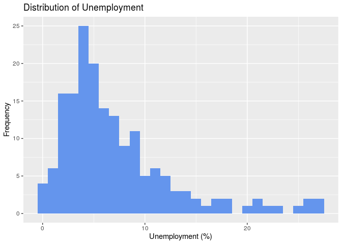
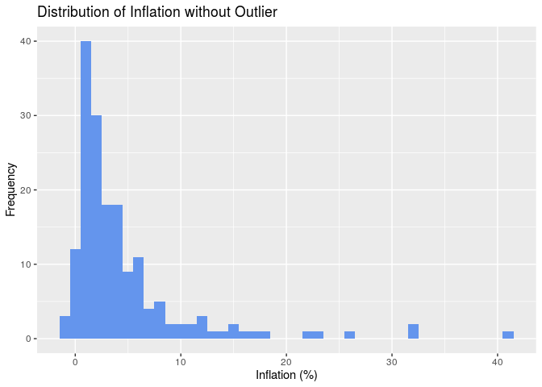
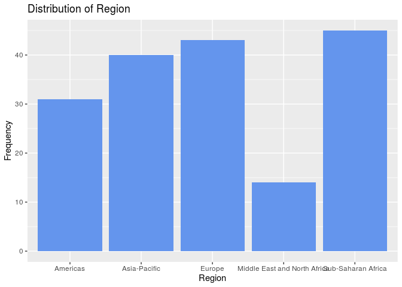

What makes a country economical great
================
Rtists
2019/10/26

``` r
library(tidyverse)
```

    ## ── Attaching packages ───────────────────────────────────────────────────────────────────────────── tidyverse 1.2.1 ──

    ## ✔ ggplot2 3.2.1     ✔ purrr   0.3.2
    ## ✔ tibble  2.1.3     ✔ dplyr   0.8.3
    ## ✔ tidyr   0.8.3     ✔ stringr 1.4.0
    ## ✔ readr   1.3.1     ✔ forcats 0.4.0

    ## ── Conflicts ──────────────────────────────────────────────────────────────────────────────── tidyverse_conflicts() ──
    ## ✖ dplyr::filter() masks stats::filter()
    ## ✖ dplyr::lag()    masks stats::lag()

``` r
library(readxl)
library(skimr)
```

    ## 
    ## Attaching package: 'skimr'

    ## The following object is masked from 'package:stats':
    ## 
    ##     filter

``` r
economic_data <- read_excel("/cloud/project/02-data/economic_data.xlsx",
col_types = c("text", "text", "text",
"numeric", "numeric", "numeric",
"numeric", "numeric", "numeric",
"numeric", "numeric", "numeric",
"numeric", "numeric", "numeric"))
```

    ## Warning in read_fun(path = enc2native(normalizePath(path)), sheet_i =
    ## sheet, : Expecting numeric in M49 / R49C13: got 'N/A'

    ## Warning in read_fun(path = enc2native(normalizePath(path)), sheet_i =
    ## sheet, : Expecting numeric in D80 / R80C4: got 'N/A'

    ## Warning in read_fun(path = enc2native(normalizePath(path)), sheet_i =
    ## sheet, : Expecting numeric in G80 / R80C7: got 'N/A'

    ## Warning in read_fun(path = enc2native(normalizePath(path)), sheet_i =
    ## sheet, : Expecting numeric in M89 / R89C13: got 'N/A'

    ## Warning in read_fun(path = enc2native(normalizePath(path)), sheet_i =
    ## sheet, : Expecting numeric in E90 / R90C5: got 'N/A'

    ## Warning in read_fun(path = enc2native(normalizePath(path)), sheet_i =
    ## sheet, : Expecting numeric in F90 / R90C6: got 'N/A'

    ## Warning in read_fun(path = enc2native(normalizePath(path)), sheet_i =
    ## sheet, : Expecting numeric in G90 / R90C7: got 'N/A'

    ## Warning in read_fun(path = enc2native(normalizePath(path)), sheet_i =
    ## sheet, : Expecting numeric in J90 / R90C10: got '$40.0 (2015 est.)'

    ## Warning in read_fun(path = enc2native(normalizePath(path)), sheet_i =
    ## sheet, : Expecting numeric in L90 / R90C12: got '$1,700 (2015 est.)'

    ## Warning in read_fun(path = enc2native(normalizePath(path)), sheet_i =
    ## sheet, : Expecting numeric in N90 / R90C14: got 'N/A'

    ## Warning in read_fun(path = enc2native(normalizePath(path)), sheet_i =
    ## sheet, : Expecting numeric in O90 / R90C15: got 'N/A'

    ## Warning in read_fun(path = enc2native(normalizePath(path)), sheet_i =
    ## sheet, : Expecting numeric in M92 / R92C13: got 'N/A'

    ## Warning in read_fun(path = enc2native(normalizePath(path)), sheet_i =
    ## sheet, : Expecting numeric in D100 / R100C4: got 'N/A'

    ## Warning in read_fun(path = enc2native(normalizePath(path)), sheet_i =
    ## sheet, : Expecting numeric in G100 / R100C7: got 'N/A'

    ## Warning in read_fun(path = enc2native(normalizePath(path)), sheet_i =
    ## sheet, : Expecting numeric in D101 / R101C4: got 'N/A'

    ## Warning in read_fun(path = enc2native(normalizePath(path)), sheet_i =
    ## sheet, : Expecting numeric in G101 / R101C7: got 'N/A'

    ## Warning in read_fun(path = enc2native(normalizePath(path)), sheet_i =
    ## sheet, : Expecting numeric in H101 / R101C8: got 'N/A'

    ## Warning in read_fun(path = enc2native(normalizePath(path)), sheet_i =
    ## sheet, : Expecting numeric in I101 / R101C9: got '38,000 ppl.'

    ## Warning in read_fun(path = enc2native(normalizePath(path)), sheet_i =
    ## sheet, : Expecting numeric in J101 / R101C10: got '$6.1 CHF (2014 )'

    ## Warning in read_fun(path = enc2native(normalizePath(path)), sheet_i =
    ## sheet, : Expecting numeric in K101 / R101C11: got 'N/A'

    ## Warning in read_fun(path = enc2native(normalizePath(path)), sheet_i =
    ## sheet, : Expecting numeric in L101 / R101C12: got '$139,100 (2009 est.)'

    ## Warning in read_fun(path = enc2native(normalizePath(path)), sheet_i =
    ## sheet, : Expecting numeric in M101 / R101C13: got '2.1 (2016)'

    ## Warning in read_fun(path = enc2native(normalizePath(path)), sheet_i =
    ## sheet, : Expecting numeric in N101 / R101C14: got 'N/A'

    ## Warning in read_fun(path = enc2native(normalizePath(path)), sheet_i =
    ## sheet, : Expecting numeric in O101 / R101C15: got 'N/A'

    ## Warning in read_fun(path = enc2native(normalizePath(path)), sheet_i =
    ## sheet, : Expecting numeric in M115 / R115C13: got 'N/A'

    ## Warning in read_fun(path = enc2native(normalizePath(path)), sheet_i =
    ## sheet, : Expecting numeric in M148 / R148C13: got 'N/A'

    ## Warning in read_fun(path = enc2native(normalizePath(path)), sheet_i =
    ## sheet, : Expecting numeric in D154 / R154C4: got 'N/A'

    ## Warning in read_fun(path = enc2native(normalizePath(path)), sheet_i =
    ## sheet, : Expecting numeric in E154 / R154C5: got 'N/A'

    ## Warning in read_fun(path = enc2native(normalizePath(path)), sheet_i =
    ## sheet, : Expecting numeric in F154 / R154C6: got 'N/A'

    ## Warning in read_fun(path = enc2native(normalizePath(path)), sheet_i =
    ## sheet, : Expecting numeric in G154 / R154C7: got 'N/A'

    ## Warning in read_fun(path = enc2native(normalizePath(path)), sheet_i =
    ## sheet, : Expecting numeric in H154 / R154C8: got 'N/A'

    ## Warning in read_fun(path = enc2native(normalizePath(path)), sheet_i =
    ## sheet, : Expecting numeric in L154 / R154C12: got 'N/A'

    ## Warning in read_fun(path = enc2native(normalizePath(path)), sheet_i =
    ## sheet, : Expecting numeric in N154 / R154C14: got 'N/A'

    ## Warning in read_fun(path = enc2native(normalizePath(path)), sheet_i =
    ## sheet, : Expecting numeric in O154 / R154C15: got 'N/A'

    ## Warning in read_fun(path = enc2native(normalizePath(path)), sheet_i =
    ## sheet, : Expecting numeric in G162 / R162C7: got 'N/A'

    ## Warning in read_fun(path = enc2native(normalizePath(path)), sheet_i =
    ## sheet, : Expecting numeric in H162 / R162C8: got 'N/A'

    ## Warning in read_fun(path = enc2native(normalizePath(path)), sheet_i =
    ## sheet, : Expecting numeric in J162 / R162C10: got 'N/A'

    ## Warning in read_fun(path = enc2native(normalizePath(path)), sheet_i =
    ## sheet, : Expecting numeric in K162 / R162C11: got 'N/A'

    ## Warning in read_fun(path = enc2native(normalizePath(path)), sheet_i =
    ## sheet, : Expecting numeric in L162 / R162C12: got 'N/A'

    ## Warning in read_fun(path = enc2native(normalizePath(path)), sheet_i =
    ## sheet, : Expecting numeric in N162 / R162C14: got 'N/A'

    ## Warning in read_fun(path = enc2native(normalizePath(path)), sheet_i =
    ## sheet, : Expecting numeric in O162 / R162C15: got 'N/A'

    ## Warning in read_fun(path = enc2native(normalizePath(path)), sheet_i =
    ## sheet, : Expecting numeric in E184 / R184C5: got 'N/A'

    ## Warning in read_fun(path = enc2native(normalizePath(path)), sheet_i =
    ## sheet, : Expecting numeric in F184 / R184C6: got 'N/A'

    ## Warning in read_fun(path = enc2native(normalizePath(path)), sheet_i =
    ## sheet, : Expecting numeric in G184 / R184C7: got 'N/A'

    ## Warning in read_fun(path = enc2native(normalizePath(path)), sheet_i =
    ## sheet, : Expecting numeric in H184 / R184C8: got 'N/A'

``` r
happiness_data <- read_excel("/cloud/project/02-data/happiness_data.xlsx")

country_data <- full_join(economic_data, happiness_data, by = "Country")
```

## Section 1. Introduction

GDP is a measure of how productive a given country or region is based on
the value of the goods and services that it produces. Consequently, a
high GDP signals that a country has a great deal of economic influence.
As emerging markets continue to industrialize, the question of how one
achieves a larger GDP is becoming a critical one in policy selection;
failure to design policies that encourage GDP growth can cause
widespread suffering for a country’s population. Consider the case of
Venezuela, where GDP-friendly policies were shunned and massive unrest
appeared as a nearly direct consequence. In order to avoid this fate,
nations must analyze which economic sectors are most influential on GDP
in order to create guiding policies. In this project, we will address
the research question of what predictors are most useful in predicting
GDP and to what extent GDP can be predicted successfully; we expect that
factors such as population, inflation, GovInterference, and TaxBurden
will most effectively predict GDP.

## Section 2. Regression Analysis

``` r
glimpse(country_data)
```

    ## Observations: 193
    ## Variables: 16
    ## $ Country          <chr> "Afghanistan", "Albania", "Algeria", "Angola", …
    ## $ Region           <chr> "Asia-Pacific", "Europe", "Middle East and Nort…
    ## $ GovInterference  <chr> "Repressive", "Moderate", "Extensive", "Extensi…
    ## $ TariffRate       <dbl> 7.0, 1.1, 8.8, 9.4, 7.5, 2.1, 1.2, 2.0, 5.2, 18…
    ## $ IncomeTaxRate    <dbl> 20.0, 23.0, 35.0, 17.0, 35.0, 26.0, 45.0, 50.0,…
    ## $ CorporateTaxRate <dbl> 20.0, 15.0, 23.0, 30.0, 30.0, 20.0, 30.0, 25.0,…
    ## $ TaxBurden        <dbl> 5.0, 24.9, 24.5, 20.6, 30.8, 21.3, 28.2, 42.7, …
    ## $ GovSpending      <dbl> 25.6, 29.5, 41.4, 25.3, 41.0, 26.4, 36.5, 50.2,…
    ## $ Population       <dbl> 35.5, 2.9, 41.5, 28.2, 44.1, 3.0, 24.8, 8.8, 9.…
    ## $ GDP              <dbl> 69.6, 36.0, 632.9, 190.3, 920.2, 28.3, 1246.5, …
    ## $ GDPGrowth        <dbl> 2.5, 3.9, 2.0, 0.7, 2.9, 7.5, 2.3, 2.9, 0.1, 1.…
    ## $ GDPperCap        <dbl> 1958, 12507, 15237, 6753, 20876, 9456, 50334, 4…
    ## $ Unemployment     <dbl> 8.8, 13.9, 10.0, 8.2, 8.7, 18.2, 5.6, 5.5, 5.0,…
    ## $ Inflation        <dbl> 5.0, 2.0, 5.6, 31.7, 25.7, 0.9, 2.0, 2.2, 13.0,…
    ## $ PublicDebt       <dbl> 7.3, 71.2, 25.8, 65.3, 52.6, 53.5, 41.6, 78.8, …
    ## $ Happiness_Score  <dbl> 37.94, 46.44, 58.72, 37.95, 65.99, 43.76, 72.84…

We first take an overview of the data. We can see that there are 193
observations — one observation corresponds to one country, and 16
variables, including country name, 14 predictor variables and one
response variable that we want to predict, the happiness score.

``` r
ggplot(data = country_data, mapping = aes(x = TaxBurden)) +
  geom_histogram() + 
  labs(x = "Tax Burden (% of Country's GDP)",
       y = "Frequency",
       title = "Distribution of Tax Burden")
```

    ## `stat_bin()` using `bins = 30`. Pick better value with `binwidth`.

    ## Warning: Removed 15 rows containing non-finite values (stat_bin).

<!-- -->

``` r
economic_data %>%
select(TaxBurden) %>%
skim()
```

    ## Skim summary statistics
    ##  n obs: 185 
    ##  n variables: 1 
    ## 
    ## ── Variable type:numeric ─────────────────────────────────────────────────────────────────────────────────────────────
    ##   variable missing complete   n  mean    sd  p0   p25   p50   p75 p100
    ##  TaxBurden       7      178 185 22.19 10.17 1.6 14.12 20.75 30.02   47
    ##      hist
    ##  ▂▅▇▆▅▅▂▂

The distribution of tax burden is unimodal and only slightly right
skewed. The mode is around 14-15%. In general, the tax burden across
countries appear normally distributed. The mean tax burden is 22.19 and
the standard deviation of the distribution is 10.17.

``` r
ggplot(data = country_data, mapping = aes(x = GovSpending)) +
  geom_histogram(binwidth = 4) + 
  labs(x = "Government Spending (% of Country's GDP)",
       y = "Frequency",
       title = "Distribution of Government Spending")
```

    ## Warning: Removed 12 rows containing non-finite values (stat_bin).

<!-- -->

``` r
economic_data %>%
select(GovSpending) %>%
skim()
```

    ## Skim summary statistics
    ##  n obs: 185 
    ##  n variables: 1 
    ## 
    ## ── Variable type:numeric ─────────────────────────────────────────────────────────────────────────────────────────────
    ##     variable missing complete   n  mean    sd   p0  p25  p50  p75  p100
    ##  GovSpending       4      181 185 33.87 15.52 10.6 24.5 32.3 40.3 139.2
    ##      hist
    ##  ▅▇▂▁▁▁▁▁

The distribution of government spending is generally symmmetric and
unimodal. There are several outliers which have significantly higher
government spending: with government spending either equal to or more
than 100% of the country’s GDP. The mode of the distribution is around
25%. Since there is minimal skewing, we report the mean and standard
deviation. The mean government spending is 33.87 and the distribution
has a standard deviation of 15.52

``` r
ggplot(data = country_data, mapping = aes(x = Population)) +
  geom_histogram(binwidth = 40) + 
  labs(x = "Population (Million)",
       y = "Frequency",
       title = "Distribution of Population")
```

    ## Warning: Removed 9 rows containing non-finite values (stat_bin).

<!-- -->

``` r
ggplot(data = country_data, mapping = aes(x = Unemployment)) +
  geom_histogram(binwidth = 1) + 
  labs(x = "Unemployment (%)",
       y = "Frequency",
       title = "Distribution of Unemployment")
```

    ## Warning: Removed 14 rows containing non-finite values (stat_bin).

<!-- -->

``` r
economic_data %>%
select(Unemployment) %>%
skim()
```

    ## Skim summary statistics
    ##  n obs: 185 
    ##  n variables: 1 
    ## 
    ## ── Variable type:numeric ─────────────────────────────────────────────────────────────────────────────────────────────
    ##      variable missing complete   n mean   sd  p0  p25 p50  p75 p100
    ##  Unemployment       6      179 185 7.39 5.68 0.1 3.75 5.7 9.35 27.3
    ##      hist
    ##  ▅▇▅▂▁▁▁▁

The distribution of unemployment is unimodal and right-skewed. The mode
of the distribution is around 4-5%. Since the median and IQR are more
robust to skewing, we report them instead as a measures of center and
spread. The median is 5.7 and the IQR is 5.6.

``` r
ggplot(data = country_data, mapping = aes(x = Inflation)) +
  geom_histogram() + 
  labs(x = "Inflation (%)",
       y = "Frequency",
       title = "Distribution of Inflation")
```

    ## `stat_bin()` using `bins = 30`. Pick better value with `binwidth`.

    ## Warning: Removed 12 rows containing non-finite values (stat_bin).

<!-- -->

``` r
country_data_temp <- country_data %>% select(Inflation) %>% filter(Inflation < 100)
ggplot(data = country_data_temp, mapping = aes(x = Inflation)) +
  geom_histogram(binwidth = 1) + 
  labs(x = "Inflation (%)",
       y = "Frequency",
       title = "Distribution of Inflation without Outlier")
```

<!-- -->

``` r
economic_data %>%
select(Inflation) %>%
skim()
```

    ## Skim summary statistics
    ##  n obs: 185 
    ##  n variables: 1 
    ## 
    ## ── Variable type:numeric ─────────────────────────────────────────────────────────────────────────────────────────────
    ##   variable missing complete   n  mean    sd   p0 p25 p50 p75   p100
    ##  Inflation       4      181 185 10.61 80.73 -0.9 1.3 2.7 5.3 1087.5
    ##      hist
    ##  ▇▁▁▁▁▁▁▁

The first distribution of inflation rates includes all outliers. Because
of the size and resolution of the diagram, the distribution of most
economies are not visible. THe second diagram shows the distribution of
inflation rates without the outlier with more than 1000% inflation. The
distribution of inflation rate is generally unimodal and right skewed.
The mode of the distribution is around 2%. Given significant skewing, we
report the median and IQR as measures of center and spread. The median
inflation rate is 2.7% and the IQR is
4%.

``` r
aggregate(cbind(count = Region) ~ Region, data = economic_data, FUN = function(x){NROW(x)})
```

    ##                         Region count
    ## 1                     Americas    32
    ## 2                 Asia-Pacific    43
    ## 3                       Europe    45
    ## 4 Middle East and North Africa    18
    ## 5           Sub-Saharan Africa    47

``` r
regional = data.frame("Region" = c("Americas","Asia-Pacific","Europe","Middle East and North Africa","Sub-Saharan Africa"), "share" = c(32, 43, 45, 18, 47), "prop"=c(17.4,23.2, 24.3, 9.7, 25.4))
mycols <- c("#0073C2FF", "#EFC000FF", "#868686FF", "#CD534CFF", "#99D492")

# Add label position
regional <- regional %>%
  arrange(desc(Region)) %>%
  mutate(lab.ypos = cumsum(prop) - 0.5*prop)
regional
```

    ##                         Region share prop lab.ypos
    ## 1           Sub-Saharan Africa    47 25.4    12.70
    ## 2 Middle East and North Africa    18  9.7    30.25
    ## 3                       Europe    45 24.3    47.25
    ## 4                 Asia-Pacific    43 23.2    71.00
    ## 5                     Americas    32 17.4    91.30

``` r
ggplot(mapping = aes(x = "", y = share, fill = Region), data = regional) +
    geom_bar(stat = "identity", color = "white") +
    coord_polar("y", start = 0) +
  geom_text(aes(y = lab.ypos, label = prop), color = "white") +
    scale_fill_manual(values = mycols) +
    theme_void()
```

<!-- -->

The piechart of region shows that there is a relatively equal
representation of countries from different regions of the world. The
Americas, Asia-Pacific, and Europe each represent around 25% of all the
countries in the data. The smallest representation is from the Middle
East and North Africa at 9.7%. We are not too concerned with the
distribution because there are 195 countries in the world and our data
has 185 countries. The difference in distribution across region is
likely to be largely reflective of the actual geographical distribution
of nation-states.

``` r
ggplot(mapping = aes(x = GovInterference), data = economic_data) +
geom_bar(fill = "cornflowerblue") +
labs(title = "Bar Graph of Government Inteference in Economy", x  = "Levels of Government Interference", y = "Frequency")
```

<!-- -->

The distribution of government interference shows that most countries
either have extensive or moderate government inteference. The mode of
the distribution is moderate government interference. Economies with
limited and repressive intervention are significanly lesser, each having
around 10-15 countries. We do not report the center or spread here
because government interference is a categorical variable.

``` r
ggplot(mapping = aes(x = TariffRate), data = economic_data) +
geom_histogram(fill = "cornflowerblue") +
labs(title = "Histogram of Tariff Rate", x  = "Tariff Rate", y = "Frequency")
```

    ## `stat_bin()` using `bins = 30`. Pick better value with `binwidth`.

    ## Warning: Removed 4 rows containing non-finite values (stat_bin).

<!-- -->

``` r
economic_data %>%
select(TariffRate) %>%
skim()
```

    ## Skim summary statistics
    ##  n obs: 185 
    ##  n variables: 1 
    ## 
    ## ── Variable type:numeric ─────────────────────────────────────────────────────────────────────────────────────────────
    ##    variable missing complete   n mean   sd p0 p25 p50 p75 p100     hist
    ##  TariffRate       4      181 185 5.96 5.54  0   2 4.3 8.7   50 ▇▃▁▁▁▁▁▁

The distribution of tariff rate is generally right skewed and unimodal.
There are several outlier economies with 50% tariff rate such as Central
African Republic and North Korea. The mode of the distribution is around
2%. The median tariff rate is 4.3 and the interquartile range of the
distribution is 6.7.

``` r
ggplot(mapping = aes(x = IncomeTaxRate), data = economic_data) +
geom_histogram(fill = "cornflowerblue") +
labs(title = "Histogram of Income Tax Rate", x  = "Income Tax Rate", y = "Frequency")
```

    ## `stat_bin()` using `bins = 30`. Pick better value with `binwidth`.

    ## Warning: Removed 3 rows containing non-finite values (stat_bin).

<!-- -->

``` r
economic_data %>%
select(IncomeTaxRate) %>%
skim()
```

    ## Skim summary statistics
    ##  n obs: 185 
    ##  n variables: 1 
    ## 
    ## ── Variable type:numeric ─────────────────────────────────────────────────────────────────────────────────────────────
    ##       variable missing complete   n  mean   sd p0 p25 p50 p75 p100
    ##  IncomeTaxRate       3      182 185 28.23 13.4  0  20  30  35   60
    ##      hist
    ##  ▂▆▃▇▇▅▂▁

The distribution of income tax rate is unimodal and generally symmetric.
While its general shape resembles a normal distribution, there are
several values of income tax rate which have particularly high frequency
such as 10%, 25% and 34-35%. The mode of the distribution occurs at 35%.
Since there is relatively minimal skewing, we report the mean and
standard deviation as measures of center and spread. The mean income tax
rate is 28.23 and the standard deviation of the distribution is 13.4.

``` r
ggplot(mapping = aes(x = CorporateTaxRate), data = economic_data) +
geom_histogram(fill = "cornflowerblue") +
labs(title = "Histogram of Corporate Tax Rate", x  = "Corporate Tax Rate", y = "Frequency")
```

    ## `stat_bin()` using `bins = 30`. Pick better value with `binwidth`.

    ## Warning: Removed 3 rows containing non-finite values (stat_bin).

<!-- -->

``` r
economic_data %>%
select(CorporateTaxRate) %>%
skim()
```

    ## Skim summary statistics
    ##  n obs: 185 
    ##  n variables: 1 
    ## 
    ## ── Variable type:numeric ─────────────────────────────────────────────────────────────────────────────────────────────
    ##          variable missing complete   n  mean   sd p0 p25 p50 p75 p100
    ##  CorporateTaxRate       3      182 185 23.89 8.88  0  20  25  30   50
    ##      hist
    ##  ▁▂▂▇▆▂▁▁

The distribution of corporate tax rate is unimodal and only slightly
right skewed. The mode of the distribution is around 28-30%. Since there
is minimal skewing, we report the mean and the standard deviation as
measures of center and spread. The mean corporate tax rate is 23.89% and
the standard deviation is 8.88%.

``` r
ggplot(data = country_data, mapping = aes(x = PublicDebt)) +
  geom_histogram(binwidth = 8) + 
  labs(x = "Public Debt (% of GDP)",
       y = "Frequency",
       title = "Distribution of Public Debt")
```

    ## Warning: Removed 12 rows containing non-finite values (stat_bin).

<!-- -->

``` r
economic_data %>%
select(PublicDebt) %>%
skim()
```

    ## Skim summary statistics
    ##  n obs: 185 
    ##  n variables: 1 
    ## 
    ## ── Variable type:numeric ─────────────────────────────────────────────────────────────────────────────────────────────
    ##    variable missing complete   n  mean   sd p0  p25  p50  p75  p100
    ##  PublicDebt       4      181 185 56.32 34.2  0 34.9 49.4 69.9 236.4
    ##      hist
    ##  ▃▇▃▂▁▁▁▁

The distribution of public debt is unimodal and right skewed. There are
several outliers with public debt more than 175%. The mode of the
distribution is around 30%. The median public debt is 49.4% and the
interquartile range is 35%.

## Section 3. Regression Analysis Plan

## Section 4. References

## The Data
