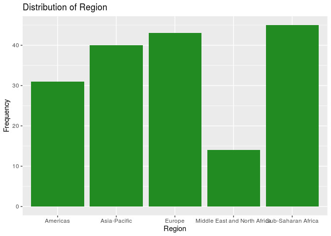
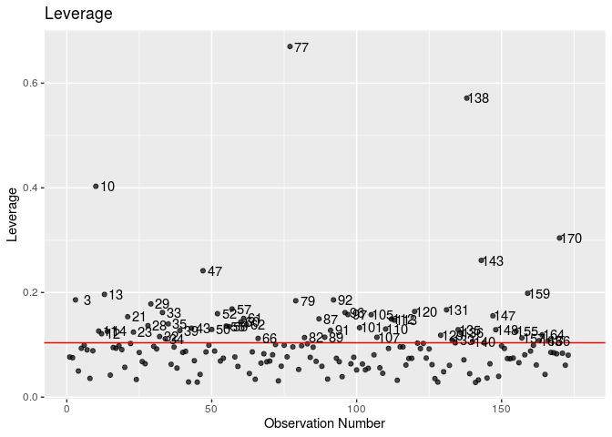

What Makes a Strong GDP?
================
Rtists
11/14/2019

    ## ── Attaching packages ───────────────────────────────────────────────────────────────────────────────────────────── tidyverse 1.2.1 ──

    ## ✔ ggplot2 3.2.1     ✔ purrr   0.3.2
    ## ✔ tibble  2.1.3     ✔ dplyr   0.8.3
    ## ✔ tidyr   0.8.3     ✔ stringr 1.4.0
    ## ✔ readr   1.3.1     ✔ forcats 0.4.0

    ## ── Conflicts ──────────────────────────────────────────────────────────────────────────────────────────────── tidyverse_conflicts() ──
    ## ✖ dplyr::filter() masks stats::filter()
    ## ✖ dplyr::lag()    masks stats::lag()

    ## 
    ## Attaching package: 'skimr'

    ## The following object is masked from 'package:stats':
    ## 
    ##     filter

    ## 
    ## Attaching package: 'magrittr'

    ## The following object is masked from 'package:purrr':
    ## 
    ##     set_names

    ## The following object is masked from 'package:tidyr':
    ## 
    ##     extract

    ## 
    ## Attaching package: 'knitr'

    ## The following object is masked from 'package:skimr':
    ## 
    ##     kable

    ## Loading required package: Hmisc

    ## Loading required package: lattice

    ## Loading required package: survival

    ## Loading required package: Formula

    ## 
    ## Attaching package: 'Hmisc'

    ## The following objects are masked from 'package:dplyr':
    ## 
    ##     src, summarize

    ## The following objects are masked from 'package:base':
    ## 
    ##     format.pval, units

    ## Loading required package: SparseM

    ## 
    ## Attaching package: 'SparseM'

    ## The following object is masked from 'package:base':
    ## 
    ##     backsolve

Your regression analysis results go here. At a minimum, the regression
analysis should include the following:

  - Statement of the research question and modeling obejctive
    (prediction, inference, etc.)
  - Description of the response variable
  - Updated exploratory data analysis, incorporating any feedback from
    the proposal
  - Explanation of the modeling process and why you chose those metohds,
    incorporating any feedback from the proposal
  - Output of the final model
  - Discussion of the assumptions for the final model
  - Interpretations / interesting findings from the model coefficients
  - Additional work of other models or analylsis not included in the
    final model.

*Use proper headings as needed.*

### Question and Objective

In this investigation, our goal is to try to understand what aspects of
a country’s economy are most associated with the GDP of the country. GDP
is one of the most foundational measures of economic growth and the size
of an economy, and as a result the majority of governments are extremely
interested in understanding what contributes to having a large GDP. This
study tries to help governments answer that question by investigating
the research question: “What indicators of a country’s economy have the
greatest effect on the country’s GDP?”

Since we already have data on all the countries and are thus don’t need
to try to “predict” the GDP of a country that may not be in our dataset,
our modeling objective isn’t prediction but rather inference, since we
are trying to understand which predictor variable has the greatest
effect on the response. Additionally, the modeling objective is
inference as we are using our data set to build a model that reliably
chooses the correct identifiers of GDP from a set of more variables than
we may potentially need.

### Response Variable

In our investigation, the response value is GDP; that is, we are trying
to determine the effect of various predictors on the GDP of countries.
GDP represents the final value of all finished goods and services
produced in a country in 2019, and in this case, in US dollars. However,
according to the EDA conducted below, since the distribution of GDP’s is
incredibly right-skewed (countries such as the US and China have
enormous GDP’s matched by no other countries), we will be building the
model using the log of GDP as our response.

### Exploratory Data Analysis

We will begin our exploratory data analysis by cleaning the data. We
notice a total of 12 countries which have a “NA” value for one or more
of the predictor variables that we will investigate. We will omit these
entries from our analysis, but we expect this to add a slight bias to
our results; the below 12 countries are all developing and thus our
model may fit developed countries better than developing countries.
However, the 12 countries below also have unusual governmental and
economic structures as well as poor data quality associated with them;
including them in the model may also significantly influence the
coefficients associated with predictors. Thus, we have decided to leave
them out of the model.

    ## # A tibble: 12 x 1
    ##    Country      
    ##    <chr>        
    ##  1 Dominica     
    ##  2 Iraq         
    ##  3 Kiribati     
    ##  4 Korea, North 
    ##  5 Kosovo       
    ##  6 Libya        
    ##  7 Liechtenstein
    ##  8 Micronesia   
    ##  9 Seychelles   
    ## 10 Somalia      
    ## 11 Syria        
    ## 12 Yemen

### Response Variable

Now that the data has been cleaned, we can begin exploring our response
variable.

<!-- -->

    ## Skim summary statistics
    ##  n obs: 173 
    ##  n variables: 1 
    ## 
    ## ── Variable type:numeric ─────────────────────────────────────────────────────────────────────────────────────────────────────────────
    ##  variable missing complete   n   mean      sd  p0  p25  p50   p75    p100
    ##       GDP       0      173 173 729.71 2486.04 0.6 28.3 88.9 439.6 23159.1
    ##      hist
    ##  ▇▁▁▁▁▁▁▁

The distribution of GDP shows significant right skew, which is
reasonable and expected as the world has countries such as the US and
China who, due to their population and industrial advantages, have
significantly greater GDP’s than the average country. We will now show a
graph of GDP with some of these influential points
    removed.

    ## `stat_bin()` using `bins = 30`. Pick better value with `binwidth`.

<!-- -->

    ## Skim summary statistics
    ##  n obs: 173 
    ##  n variables: 1 
    ## 
    ## ── Variable type:numeric ─────────────────────────────────────────────────────────────────────────────────────────────────────────────
    ##  variable missing complete   n   mean      sd  p0  p25  p50   p75    p100
    ##       GDP       0      173 173 729.71 2486.04 0.6 28.3 88.9 439.6 23159.1
    ##      hist
    ##  ▇▁▁▁▁▁▁▁

The distribution of GDP is unimodal and right-skewed. Since the media
and interquartile range are less influenced by outliers, we report them
as measures of center and spread. The median of the distribution is 88.9
billion and the interquartile range is 411.3. THe values are in billions
of dollars.

This calls for a log-transform of the response variable, whose
distribution is visualized below:

<!-- -->

    ## Skim summary statistics
    ##  n obs: 173 
    ##  n variables: 1 
    ## 
    ## ── Variable type:numeric ─────────────────────────────────────────────────────────────────────────────────────────────────────────────
    ##  variable missing complete   n mean   sd    p0  p25  p50  p75  p100
    ##    logGDP       0      173 173 4.61 2.08 -0.51 3.34 4.49 6.09 10.05
    ##      hist
    ##  ▁▃▅▇▆▅▂▁

This distribution of logGDP is normal and unimodal. We will likely use
this as our response variable. Since there is minimal skewing and the
distribution is generally symmetric, we report the mean and standard
deviation as measures of center and spread. The mean logGDP is 4.61 and
the standard deviation of its distribution is 2.08.

### Predictor Variables

We will now look at each of the 12 predictor variables that we will use
to predict GDP, starting with `TaxBurden`.

<!-- -->

    ## Skim summary statistics
    ##  n obs: 173 
    ##  n variables: 1 
    ## 
    ## ── Variable type:numeric ─────────────────────────────────────────────────────────────────────────────────────────────────────────────
    ##   variable missing complete   n  mean    sd  p0 p25  p50  p75 p100
    ##  TaxBurden       0      173 173 22.19 10.25 1.6  14 20.7 30.2   47
    ##      hist
    ##  ▂▅▇▆▅▅▂▂

`TaxBurden` represents the amount of tax paid by the citizens of a
country as a proportion of the GDP of that country. The distribution of
tax burden is unimodal and only slightly right skewed. The mode is
around 14-15%. In general, the tax burden across countries appears
normally distributed. The mean tax burden is 22.19% and the standard
deviation of the distribution is
10.17%.

<!-- -->

    ## Skim summary statistics
    ##  n obs: 173 
    ##  n variables: 1 
    ## 
    ## ── Variable type:numeric ─────────────────────────────────────────────────────────────────────────────────────────────────────────────
    ##     variable missing complete   n mean    sd   p0  p25  p50  p75 p100
    ##  GovSpending       0      173 173 32.2 10.67 10.6 23.6 31.6 39.8 64.2
    ##      hist
    ##  ▂▇▇▇▇▃▁▁

`GovSpending` represents the amount spent by the government as a
percentage of the GDP of the country. The distribution of government
spending is generally symmmetric and unimodal. The mode of the
distribution is around 25%. Since there is minimal skewing, we report
the mean and standard deviation. The mean government spending is 33.87%
of GDP and the distribution has a standard deviation of 15.52%.

<!-- -->

    ## Skim summary statistics
    ##  n obs: 173 
    ##  n variables: 1 
    ## 
    ## ── Variable type:numeric ─────────────────────────────────────────────────────────────────────────────────────────────────────────────
    ##    variable missing complete   n  mean     sd  p0 p25 p50  p75   p100
    ##  Population       0      173 173 42.16 149.89 0.1 2.9 9.5 31.4 1390.1
    ##      hist
    ##  ▇▁▁▁▁▁▁▁

`Population` represents the number of individuals living in a country.
The distribution of population is unimodal and right-skewed. Because
there are two influential points in “population”, we will plot another
graph of population without these two points
below.

<!-- -->

    ## Skim summary statistics
    ##  n obs: 173 
    ##  n variables: 1 
    ## 
    ## ── Variable type:numeric ─────────────────────────────────────────────────────────────────────────────────────────────────────────────
    ##    variable missing complete   n  mean     sd  p0 p25 p50  p75   p100
    ##  Population       0      173 173 42.16 149.89 0.1 2.9 9.5 31.4 1390.1
    ##      hist
    ##  ▇▁▁▁▁▁▁▁

The distribution of population is unimodal and right-skewed. The mode of
the distribution is around 1 million. Since the median and IQR are more
robust to skewing, we report them instead as a measures of center and
spread. The median is 9.15 and the IQR is 26.85. Additionally, when
conducting our analysis, we may need to apply a log-transform to make
the distribution of the variable more normal; based on a pairs plot,
population has a logarithmic relationship with logGDP and thus we will
apply a logarithmic transform to population
    below.

    ## `stat_bin()` using `bins = 30`. Pick better value with `binwidth`.

<!-- -->

Based on the above plot, the logarithmic transformation has been
successful in normalizing the population variable, which should allow a
more linear relationship with GDP.

<!-- -->

    ## Skim summary statistics
    ##  n obs: 173 
    ##  n variables: 1 
    ## 
    ## ── Variable type:numeric ─────────────────────────────────────────────────────────────────────────────────────────────────────────────
    ##      variable missing complete   n mean   sd  p0 p25 p50 p75 p100     hist
    ##  Unemployment       0      173 173 7.27 5.67 0.1 3.7 5.5 9.3 27.3 ▆▇▅▂▁▁▁▁

`Unemployment` represents the percantage of the workforce of a country
that is currently not working. The distribution of unemployment is
unimodal and right-skewed. The mode of the distribution is around 4-5%.
Since the median and IQR are more robust to skewing, we report them
instead as a measures of center and spread. The median is 5.7 and the
IQR is
    5.6.

    ## `stat_bin()` using `bins = 30`. Pick better value with `binwidth`.

<!-- --><!-- -->

    ## Skim summary statistics
    ##  n obs: 173 
    ##  n variables: 1 
    ## 
    ## ── Variable type:numeric ─────────────────────────────────────────────────────────────────────────────────────────────────────────────
    ##   variable missing complete   n  mean    sd   p0 p25 p50 p75   p100
    ##  Inflation       0      173 173 10.87 82.56 -0.9 1.3 2.8 5.5 1087.5
    ##      hist
    ##  ▇▁▁▁▁▁▁▁

    ## # A tibble: 4 x 2
    ## # Groups:   cat_inflation [4]
    ##   cat_inflation        n
    ##   <chr>            <int>
    ## 1 Dangerously High    39
    ## 2 Healthy             62
    ## 3 High                42
    ## 4 Low                 30

<!-- -->

`Inflation` represents the change in prices of goods and services in a
year in the country. The first distribution of inflation rates includes
all outliers. Because of the size and resolution of the diagram, the
distribution of most economies are not visible. The second diagram shows
the distribution of inflation rates without the outlier with more than
1000% inflation. The distribution of inflation rate is generally
unimodal and right skewed. The mode of the distribution is around 2%.
Given significant skewing, we report the median and IQR as measures of
center and spread. The median inflation rate is 2.7% and the IQR is 4%.
Because inflation can vary widely between countries, we have recoded it
into a categorical variable that better captures whether a country’s
inflation is healthy or unhealthy. Above is a plot to show the frequency
of each level of
inflation.

<!-- --><!-- -->

`Region` represents the geographical continent/area that the country is
situated in. The bar graph and piechart of `Region` shows that there is
a relatively equal representation of countries from different regions of
the world. The Americas, Asia-Pacific, Sub-Saharan Africa, and Europe
each represent around 25% of all the countries in the data. The smallest
representation is from the Middle East and North Africa at 8.1%. We are
not too concerned with the distribution because there are 195 countries
in the world and our data has 173 countries. The difference in
distribution across region is likely to be largely reflective of the
actual geographical distribution of
nation-states.

<!-- -->

`GovInterference` represents the amount of interference that the
government has in the economy as determined by the World Economic Index.
The distribution of government interference shows that most countries
either have extensive or moderate government inteference. The mode of
the distribution is moderate government interference. Economies with
limited and repressive intervention are significanly lesser, each having
around 10-15 countries. We do not report the center or spread here
because government interference is a categorical
variable.

<!-- -->

<!-- -->

    ## Skim summary statistics
    ##  n obs: 173 
    ##  n variables: 1 
    ## 
    ## ── Variable type:numeric ─────────────────────────────────────────────────────────────────────────────────────────────────────────────
    ##    variable missing complete   n mean  sd p0 p25 p50 p75 p100     hist
    ##  TariffRate       0      173 173 5.61 4.4  0   2 4.2 8.7 18.6 ▇▅▃▃▃▁▁▁

`TariffRate` represents the average percentage tax on imports that the
country has outstanding as of 2019. The distribution of tariff rate is
generally right skewed and unimodal. There are several outlier economies
with 50% tariff rate such as Central African Republic and North Korea.
The mode of the distribution is around 2%. The median tariff rate is 4.3
and the interquartile range of the distribution is 6.7. Because of this
right-skew, log-transforming this variable might be necessary; we will
examine it further in a pairs plot later in the
analysis.

<!-- -->

    ## Skim summary statistics
    ##  n obs: 173 
    ##  n variables: 1 
    ## 
    ## ── Variable type:numeric ─────────────────────────────────────────────────────────────────────────────────────────────────────────────
    ##       variable missing complete   n  mean    sd p0 p25 p50 p75 p100
    ##  IncomeTaxRate       0      173 173 28.78 13.32  0  20  30  35   60
    ##      hist
    ##  ▂▅▂▇▇▅▂▁

`IncomeTaxRate` represents the average tax rate applied to individuals
on their incomes. The distribution of income tax rate is unimodal and
generally symmetric. While its general shape resembles a normal
distribution, there are several values of income tax rate which have
particularly high frequency such as 10%, 25% and 34-35%. The mode of the
distribution occurs at 35%. Since there is relatively minimal skewing,
we report the mean and standard deviation as measures of center and
spread. The mean income tax rate is 28.23 and the standard deviation of
the distribution is
13.4.

<!-- -->

    ## Skim summary statistics
    ##  n obs: 173 
    ##  n variables: 1 
    ## 
    ## ── Variable type:numeric ─────────────────────────────────────────────────────────────────────────────────────────────────────────────
    ##          variable missing complete   n  mean   sd p0 p25 p50 p75 p100
    ##  CorporateTaxRate       0      173 173 23.95 8.89  0  20  25  30   50
    ##      hist
    ##  ▁▂▂▇▆▂▁▁

`CorporateTaxRate` represents the average tax rate applied to
corporations on their revenues. The distribution of corporate tax rate
is unimodal and only slightly right skewed. The mode of the distribution
is around 28-30%. Since there is minimal skewing, we report the mean and
the standard deviation as measures of center and spread. The mean
corporate tax rate is 23.89% and the standard deviation is 8.88%.

<!-- -->

    ## Skim summary statistics
    ##  n obs: 173 
    ##  n variables: 1 
    ## 
    ## ── Variable type:numeric ─────────────────────────────────────────────────────────────────────────────────────────────────────────────
    ##    variable missing complete   n  mean   sd p0  p25  p50  p75  p100
    ##  PublicDebt       0      173 173 56.46 33.8  0 35.2 49.4 69.9 236.4
    ##      hist
    ##  ▃▇▃▂▁▁▁▁

`PublicDebt` represents the debt of the country as a percentage of the
country’s GDP. The distribution of public debt is unimodal and right
skewed. There are several outliers with public debt more than 175%. The
mode of the distribution is around 30%. The median public debt is 49.4%
and the interquartile range is 35%.

### Multivariate Exploration

Finally, we can visualize paired scatter plots of the relationship
between GDP and each of our predictor variables. This is shown below.
Many of the plots are visually difficult and don’t offer good
information as there are outliers that skew the
visualization.

<!-- --><!-- -->

To better help us visualize the relationship between the predictor and
response variables for most data points, we plotted a scatterplot matrix
with most of the outliers
removed.

<!-- --><!-- -->

Based on the scatterplots above, we observe that most predictor
variables do not have a clear linear relationship with the response
variable GDP. Thus, we log transform GDP to see if there is a stronger
linear relationship. As seen previously, logGDP has a normal
distribution while GDP is extremely right
skewed.

<!-- --><!-- -->

Based on the scatterplots of the response variables against the
quantitative predictor variables, we see that there is now a much
stronger a linear relationship between the two. Particularly, we note
that the logGDP against population scatterplot shows a curved
distribution which resembles a logarithimic function. This is why we
transformed population into the logpop variable, which has a linear
relationship with GDP. Furthermore, the pairs plot validates all of the
transformations we have applied in the univariate analysis, so they will
remain in place for our regression.

Moreover, we also noticed some multicollinearity issues between
predictor variables. In specific, the relationship between GovSpending
and TaxBurden appears very strongly if not almost linear. Other
variables suspect of multicollinearity problems include tariff rate and
unemployment as well as tariff rate and
unemployment.

<!-- --><!-- -->

For the relationship between the response and categorical variables, the
various boxplots suggest that there are generally normally distributed
with minimal skewing. This means that a linear regression between log
GDP and the categorical variables of region and government interference
are appropriate.

We will now mean-center a few of the variables investigated thus far to
ensure meaningful intercepts during the regression.

### Methods & Modelling

Our approach to model selection is as such: we will be running model
selection using all three selection criteria - AIC, BIC, and adjusted
R^2 - and thereafter compare the three models to decide on the final
model.

We have three categorical variables here: cat\_inflation, Region, and
GovInterference. We begin by first setting “Healthy” as the baseline for
cat\_inflation and “Moderate” as the baseline for GovInterference. These
are chosen as the baseline conditions of a healthy inflation rate and
moderate government interference are often seen as the norm. Excessive
government intervention and unhealthy inflation - whether is it too low,
high, or dangerously high - are, in contrast, deviant conditions.

``` r
economic_data <- economic_data %>%
  mutate(cat_inflation = relevel(cat_inflation, ref = "Healthy", ordered = FALSE))
```

``` r
economic_data <- economic_data %>%
  mutate(GovInterference = as.factor(GovInterference))

economic_data <- economic_data %>%
  mutate(GovInterference = relevel(GovInterference, ref = "Moderate", ordered = FALSE))
```

#### Selection using AIC

Below, we conduct model selection using AIC. We first use backward
selection then forward selection and check if the final model selected
is
different.

``` r
aic_full_model <- lm(logGDP ~ TariffRate + logpop + Unemployment + cat_inflation + PublicDebt + GovSpendingCent + IncomeTaxRate + CorporateTaxRate + TaxBurdenCent + GDPGrowth + Region + GovInterference, data = economic_data)

aic_backward_model <- step(aic_full_model, direction = "backward")
```

    ## Start:  AIC=-100.41
    ## logGDP ~ TariffRate + logpop + Unemployment + cat_inflation + 
    ##     PublicDebt + GovSpendingCent + IncomeTaxRate + CorporateTaxRate + 
    ##     TaxBurdenCent + GDPGrowth + Region + GovInterference
    ## 
    ##                    Df Sum of Sq    RSS      AIC
    ## - PublicDebt        1      0.00  78.64 -102.404
    ## - IncomeTaxRate     1      0.04  78.67 -102.331
    ## - Unemployment      1      0.64  79.27 -101.009
    ## - CorporateTaxRate  1      0.77  79.40 -100.723
    ## <none>                           78.63 -100.408
    ## - GovSpendingCent   1      2.67  81.30  -96.638
    ## - TariffRate        1      4.56  83.19  -92.658
    ## - TaxBurdenCent     1      4.77  83.40  -92.227
    ## - cat_inflation     3      7.02  85.65  -91.620
    ## - GovInterference   1      6.58  85.21  -88.512
    ## - GDPGrowth         1      9.49  88.12  -82.696
    ## - Region            4     25.99 104.63  -59.000
    ## - logpop            1    402.39 481.02  210.914
    ## 
    ## Step:  AIC=-102.4
    ## logGDP ~ TariffRate + logpop + Unemployment + cat_inflation + 
    ##     GovSpendingCent + IncomeTaxRate + CorporateTaxRate + TaxBurdenCent + 
    ##     GDPGrowth + Region + GovInterference
    ## 
    ##                    Df Sum of Sq    RSS      AIC
    ## - IncomeTaxRate     1      0.04  78.67 -104.320
    ## - Unemployment      1      0.67  79.30 -102.943
    ## - CorporateTaxRate  1      0.77  79.41 -102.720
    ## <none>                           78.64 -102.404
    ## - GovSpendingCent   1      2.69  81.32  -98.593
    ## - TariffRate        1      4.65  83.28  -94.468
    ## - TaxBurdenCent     1      4.77  83.40  -94.222
    ## - cat_inflation     3      7.02  85.65  -93.620
    ## - GovInterference   1      6.65  85.29  -90.356
    ## - GDPGrowth         1      9.50  88.14  -84.668
    ## - Region            4     26.05 104.69  -60.898
    ## - logpop            1    403.12 481.76  209.179
    ## 
    ## Step:  AIC=-104.32
    ## logGDP ~ TariffRate + logpop + Unemployment + cat_inflation + 
    ##     GovSpendingCent + CorporateTaxRate + TaxBurdenCent + GDPGrowth + 
    ##     Region + GovInterference
    ## 
    ##                    Df Sum of Sq    RSS      AIC
    ## - Unemployment      1      0.64  79.31 -104.922
    ## <none>                           78.67 -104.320
    ## - CorporateTaxRate  1      1.26  79.93 -103.576
    ## - GovSpendingCent   1      2.65  81.32 -100.591
    ## - TariffRate        1      4.68  83.36  -96.316
    ## - TaxBurdenCent     1      5.15  83.82  -95.354
    ## - cat_inflation     3      7.16  85.84  -95.248
    ## - GovInterference   1      6.70  85.38  -92.172
    ## - GDPGrowth         1      9.47  88.14  -86.662
    ## - Region            4     26.46 105.13  -62.164
    ## - logpop            1    453.15 531.82  224.283
    ## 
    ## Step:  AIC=-104.92
    ## logGDP ~ TariffRate + logpop + cat_inflation + GovSpendingCent + 
    ##     CorporateTaxRate + TaxBurdenCent + GDPGrowth + Region + GovInterference
    ## 
    ##                    Df Sum of Sq    RSS      AIC
    ## <none>                           79.31 -104.922
    ## - CorporateTaxRate  1      1.12  80.43 -104.498
    ## - GovSpendingCent   1      2.17  81.48 -102.258
    ## - TaxBurdenCent     1      4.51  83.83  -97.348
    ## - TariffRate        1      4.53  83.85  -97.304
    ## - cat_inflation     3      8.48  87.79  -93.356
    ## - GovInterference   1      7.01  86.32  -92.271
    ## - GDPGrowth         1      8.83  88.14  -88.662
    ## - Region            4     27.65 106.96  -61.184
    ## - logpop            1    467.16 546.47  226.983

``` r
aic_null_model <- lm(logGDP ~ 1, data = economic_data)

aic_forward_model <- step(aic_null_model, scope = formula(aic_full_model), direction = "forward")
```

    ## Start:  AIC=254.65
    ## logGDP ~ 1
    ## 
    ##                    Df Sum of Sq    RSS    AIC
    ## + logpop            1    496.28 248.94  66.96
    ## + TariffRate        1     93.66 651.57 233.41
    ## + Region            4    112.23 633.00 234.41
    ## + GovInterference   1     70.14 675.09 239.55
    ## + IncomeTaxRate     1     23.40 721.83 251.13
    ## + Unemployment      1     16.80 728.43 252.70
    ## <none>                          745.23 254.65
    ## + TaxBurdenCent     1      3.98 741.25 255.72
    ## + CorporateTaxRate  1      3.08 742.14 255.93
    ## + GovSpendingCent   1      2.36 742.86 256.10
    ## + PublicDebt        1      2.24 742.98 256.13
    ## + GDPGrowth         1      0.02 745.21 256.64
    ## + cat_inflation     3      8.73 736.49 258.61
    ## 
    ## Step:  AIC=66.96
    ## logGDP ~ logpop
    ## 
    ##                    Df Sum of Sq    RSS     AIC
    ## + Region            4   124.050 124.89 -44.369
    ## + TariffRate        1    74.792 174.15   7.148
    ## + GovInterference   1    72.280 176.66   9.625
    ## + cat_inflation     3    48.597 200.35  35.389
    ## + GovSpendingCent   1    42.890 206.05  36.248
    ## + TaxBurdenCent     1    42.441 206.50  36.625
    ## + CorporateTaxRate  1    39.303 209.64  39.233
    ## + GDPGrowth         1     9.792 239.15  62.018
    ## <none>                          248.94  66.960
    ## + PublicDebt        1     0.963 247.98  68.290
    ## + IncomeTaxRate     1     0.352 248.59  68.715
    ## + Unemployment      1     0.025 248.92  68.943
    ## 
    ## Step:  AIC=-44.37
    ## logGDP ~ logpop + Region
    ## 
    ##                    Df Sum of Sq    RSS     AIC
    ## + GovInterference   1   18.5885 106.31 -70.248
    ## + cat_inflation     3   15.1889 109.70 -60.802
    ## + TariffRate        1   10.1830 114.71 -57.083
    ## + TaxBurdenCent     1    6.9412 117.95 -52.261
    ## + GDPGrowth         1    6.3745 118.52 -51.432
    ## + GovSpendingCent   1    2.2755 122.62 -45.550
    ## <none>                          124.89 -44.369
    ## + CorporateTaxRate  1    1.1701 123.72 -43.997
    ## + IncomeTaxRate     1    1.0811 123.81 -43.873
    ## + PublicDebt        1    0.3532 124.54 -42.859
    ## + Unemployment      1    0.0003 124.89 -42.370
    ## 
    ## Step:  AIC=-70.25
    ## logGDP ~ logpop + Region + GovInterference
    ## 
    ##                    Df Sum of Sq     RSS     AIC
    ## + GDPGrowth         1    8.6872  97.617 -82.997
    ## + cat_inflation     3   10.2832  96.021 -81.848
    ## + TaxBurdenCent     1    4.5921 101.713 -75.887
    ## + TariffRate        1    4.5888 101.716 -75.882
    ## + GovSpendingCent   1    2.5068 103.798 -72.376
    ## + IncomeTaxRate     1    1.4486 104.856 -70.622
    ## <none>                          106.305 -70.248
    ## + CorporateTaxRate  1    0.0532 106.251 -68.335
    ## + PublicDebt        1    0.0389 106.266 -68.311
    ## + Unemployment      1    0.0160 106.289 -68.274
    ## 
    ## Step:  AIC=-83
    ## logGDP ~ logpop + Region + GovInterference + GDPGrowth
    ## 
    ##                    Df Sum of Sq    RSS     AIC
    ## + cat_inflation     3    8.9655 88.652 -93.663
    ## + TariffRate        1    4.8624 92.755 -89.836
    ## + TaxBurdenCent     1    3.4041 94.213 -87.137
    ## <none>                          97.617 -82.997
    ## + IncomeTaxRate     1    0.8360 96.781 -82.485
    ## + GovSpendingCent   1    0.3774 97.240 -81.667
    ## + CorporateTaxRate  1    0.1945 97.423 -81.342
    ## + Unemployment      1    0.1799 97.438 -81.316
    ## + PublicDebt        1    0.0001 97.617 -80.997
    ## 
    ## Step:  AIC=-93.66
    ## logGDP ~ logpop + Region + GovInterference + GDPGrowth + cat_inflation
    ## 
    ##                    Df Sum of Sq    RSS      AIC
    ## + TariffRate        1    4.6454 84.007 -100.975
    ## + TaxBurdenCent     1    2.4079 86.244  -96.427
    ## <none>                          88.652  -93.663
    ## + CorporateTaxRate  1    0.2659 88.386  -92.183
    ## + GovSpendingCent   1    0.0673 88.585  -91.794
    ## + IncomeTaxRate     1    0.0502 88.602  -91.761
    ## + Unemployment      1    0.0177 88.634  -91.698
    ## + PublicDebt        1    0.0103 88.642  -91.683
    ## 
    ## Step:  AIC=-100.97
    ## logGDP ~ logpop + Region + GovInterference + GDPGrowth + cat_inflation + 
    ##     TariffRate
    ## 
    ##                    Df Sum of Sq    RSS      AIC
    ## + TaxBurdenCent     1   2.03354 81.973 -103.214
    ## <none>                          84.007 -100.975
    ## + CorporateTaxRate  1   0.18088 83.826  -99.347
    ## + IncomeTaxRate     1   0.08925 83.917  -99.158
    ## + PublicDebt        1   0.01375 83.993  -99.003
    ## + Unemployment      1   0.00162 84.005  -98.978
    ## + GovSpendingCent   1   0.00137 84.005  -98.977
    ## 
    ## Step:  AIC=-103.21
    ## logGDP ~ logpop + Region + GovInterference + GDPGrowth + cat_inflation + 
    ##     TariffRate + TaxBurdenCent
    ## 
    ##                    Df Sum of Sq    RSS     AIC
    ## + GovSpendingCent   1   1.54136 80.432 -104.50
    ## <none>                          81.973 -103.21
    ## + CorporateTaxRate  1   0.49334 81.480 -102.26
    ## + Unemployment      1   0.14744 81.826 -101.53
    ## + IncomeTaxRate     1   0.13089 81.842 -101.49
    ## + PublicDebt        1   0.05708 81.916 -101.33
    ## 
    ## Step:  AIC=-104.5
    ## logGDP ~ logpop + Region + GovInterference + GDPGrowth + cat_inflation + 
    ##     TariffRate + TaxBurdenCent + GovSpendingCent
    ## 
    ##                    Df Sum of Sq    RSS     AIC
    ## + CorporateTaxRate  1   1.11903 79.313 -104.92
    ## <none>                          80.432 -104.50
    ## + Unemployment      1   0.49951 79.932 -103.58
    ## + IncomeTaxRate     1   0.38006 80.052 -103.32
    ## + PublicDebt        1   0.05886 80.373 -102.62
    ## 
    ## Step:  AIC=-104.92
    ## logGDP ~ logpop + Region + GovInterference + GDPGrowth + cat_inflation + 
    ##     TariffRate + TaxBurdenCent + GovSpendingCent + CorporateTaxRate
    ## 
    ##                 Df Sum of Sq    RSS     AIC
    ## <none>                       79.313 -104.92
    ## + Unemployment   1   0.63868 78.674 -104.32
    ## + PublicDebt     1   0.03383 79.279 -103.00
    ## + IncomeTaxRate  1   0.00994 79.303 -102.94

AIC backward selection: logGDP ~ TariffRate + logpop + cat\_inflation +
GovSpendingCent + CorporateTaxRate + TaxBurdenCent + GDPGrowth + Region
+ GovInterference

AIC forward selection: logGDP ~ TariffRate + logpop + cat\_inflation +
GovSpendingCent + CorporateTaxRate + TaxBurdenCent + GDPGrowth + Region
+ GovInterference

As we have seen from the model selection process above, both forward and
backward selection rendered the same final model. We will however not be
choosing this model immediately. Instead, we will compare it with the
other models generated using other selection criteria such as BIC and
adj
R^2.

| term                               |    estimate | std.error |   statistic |   p.value |    conf.low |   conf.high |
| :--------------------------------- | ----------: | --------: | ----------: | --------: | ----------: | ----------: |
| (Intercept)                        |   3.7419175 | 0.2630588 |  14.2246417 | 0.0000000 |   3.2223521 |   4.2614829 |
| TariffRate                         | \-0.0474462 | 0.0157872 | \-3.0053608 | 0.0030861 | \-0.0786274 | \-0.0162650 |
| logpop                             |   1.0165056 | 0.0333211 |  30.5063234 | 0.0000000 |   0.9506932 |   1.0823179 |
| cat\_inflationDangerously High     | \-0.4256532 | 0.1635835 | \-2.6020545 | 0.0101478 | \-0.7487457 | \-0.1025607 |
| cat\_inflationHigh                 | \-0.5116288 | 0.1549753 | \-3.3013562 | 0.0011896 | \-0.8177193 | \-0.2055382 |
| cat\_inflationLow                  |   0.0415998 | 0.1664769 |   0.2498832 | 0.8030022 | \-0.2872074 |   0.3704069 |
| GovSpendingCent                    | \-0.0195980 | 0.0094324 | \-2.0777415 | 0.0393508 | \-0.0382278 | \-0.0009682 |
| CorporateTaxRate                   | \-0.0119116 | 0.0079780 | \-1.4930639 | 0.1374147 | \-0.0276689 |   0.0038456 |
| TaxBurdenCent                      |   0.0332804 | 0.0110994 |   2.9983836 | 0.0031537 |   0.0113580 |   0.0552028 |
| GDPGrowth                          | \-0.0979726 | 0.0233611 | \-4.1938316 | 0.0000456 | \-0.1441130 | \-0.0518322 |
| RegionAsia-Pacific                 |   0.2626906 | 0.1936575 |   1.3564699 | 0.1768848 | \-0.1198008 |   0.6451819 |
| RegionEurope                       |   0.2204642 | 0.2128560 |   1.0357435 | 0.3019044 | \-0.1999460 |   0.6408744 |
| RegionMiddle East and North Africa |   0.8347061 | 0.2717274 |   3.0718512 | 0.0025057 |   0.2980195 |   1.3713928 |
| RegionSub-Saharan Africa           | \-0.8473786 | 0.1862555 | \-4.5495504 | 0.0000107 | \-1.2152503 | \-0.4795069 |
| GovInterferenceExtensive           | \-0.5116125 | 0.1369156 | \-3.7366985 | 0.0002601 | \-0.7820335 | \-0.2411915 |

#### Selection using BIC

We now conduct model selection using BIC. Same as before, we do both
forward and backward selection for
comparison.

``` r
regfit_backward <- regsubsets(logGDP ~ TariffRate + logpop + Unemployment + cat_inflation + PublicDebt + GovSpendingCent + IncomeTaxRate + CorporateTaxRate + TaxBurdenCent + GDPGrowth + GovInterference + Region, data = economic_data, method="backward")

sel_summary <- summary(regfit_backward)
coef(regfit_backward, which.min(sel_summary$bic))
```

    ##                   (Intercept)                    TariffRate 
    ##                    3.84221675                   -0.05541749 
    ##                        logpop cat_inflationDangerously High 
    ##                    1.00198954                   -0.51048522 
    ##             cat_inflationHigh                     GDPGrowth 
    ##                   -0.57317368                   -0.08294272 
    ##      GovInterferenceExtensive      RegionSub-Saharan Africa 
    ##                   -0.66337220                   -1.13792903

``` r
regfit_forward <- regsubsets(logGDP ~ TariffRate + logpop + Unemployment + cat_inflation + PublicDebt + GovSpendingCent + IncomeTaxRate + CorporateTaxRate + TaxBurdenCent + GDPGrowth + GovInterference + Region, data = economic_data, method="forward")

sel_summary <- summary(regfit_forward)
coef(regfit_forward, which.min(sel_summary$bic))
```

    ##                   (Intercept)                    TariffRate 
    ##                    3.84221675                   -0.05541749 
    ##                        logpop cat_inflationDangerously High 
    ##                    1.00198954                   -0.51048522 
    ##             cat_inflationHigh                     GDPGrowth 
    ##                   -0.57317368                   -0.08294272 
    ##      GovInterferenceExtensive      RegionSub-Saharan Africa 
    ##                   -0.66337220                   -1.13792903

From the above, we see that both the forward and backward selection
process rendered the same model.

#### Selection using adj R^2

We now conduct model selection using adj R^2. Same as before, we do both
forward and backward selection for comparison.

``` r
sel_summary <- summary(regfit_backward)
coef(regfit_backward, which.max(sel_summary$adjr2))
```

    ##                   (Intercept)                    TariffRate 
    ##                    3.74431705                   -0.04998866 
    ##                        logpop cat_inflationDangerously High 
    ##                    1.01165029                   -0.46830454 
    ##             cat_inflationHigh                 TaxBurdenCent 
    ##                   -0.53642530                    0.01104291 
    ##                     GDPGrowth      GovInterferenceExtensive 
    ##                   -0.08029032                   -0.62499945 
    ##      RegionSub-Saharan Africa 
    ##                   -1.12006020

``` r
sel_summary <- summary(regfit_forward)
coef(regfit_forward, which.max(sel_summary$adjr2))
```

    ##                   (Intercept)                    TariffRate 
    ##                    3.74431705                   -0.04998866 
    ##                        logpop cat_inflationDangerously High 
    ##                    1.01165029                   -0.46830454 
    ##             cat_inflationHigh                 TaxBurdenCent 
    ##                   -0.53642530                    0.01104291 
    ##                     GDPGrowth      GovInterferenceExtensive 
    ##                   -0.08029032                   -0.62499945 
    ##      RegionSub-Saharan Africa 
    ##                   -1.12006020

From the above, we see that both the forward and backward selection
process rendered the same model.

#### Model Comparison between all 3 Selection Criteria

Model selected using AIC: logGDP ~ TariffRate + logpop + GDPGrowth +
TaxBurdenCent + GovSpendingCent + cat\_inflationDangerouslyHigh +
cat\_inflationHigh + cat\_inflationLow + RegionAsia-Pacific +
RegionEurope + RegionMiddleEastandNorthAfrica + RegionSub-SaharanAfrica
+ GovInterferenceLimited + GovInterferenceExtensive +
GovInterferenceRepressive

Model selected using BIC: logGDP ~ TariffRate + logpop + GDPGrowth +
cat\_inflationDangerouslyHigh + cat\_inflationHigh +
GovInterferenceExtensive + RegionSub-Saharan Africa

Model selected using adj R^2: logGDP ~ TariffRate + logpop + GDPGrowth +
TaxBurdenCent + cat\_inflationDangerously High + cat\_inflationHigh +
GovInterferenceLimited + GovInterferenceModerate + RegionSub-Saharan
Africa

From the final equations generated using different selection criteria,
we see that all three selection criteria included TariffRate + logpop +
GDPGrowth + GovInterference in the final model. For that reason, we
decide to include all four of these predictors into our final model.

cat\_inflation is included in all three equations, though for BIC and
adj R^2, the level of low inflation is excluded. This is not surprising
considering that the p-value of the cat\_inflationLow coefficient in the
AIC model is 0.8030022, implying that this coefficient is probably very
statistically insignificant.

While there is one level that could be very statistically insignificant,
we will choose to include cat\_inflation in the final model for the
following reasons. One, a categorical variable with 4 levels require us
to use 3 dummy variables. Removing one because it is insignificant will
affect the coefficients of the other levels because the missing level
has to be forcibly added to either of the three category. We will also
not change the categories of inflation rates because the present
classification references economic literature which generally suggests
four levels of inflation rates: low, healthy, high, and dangerously high
(hyperinflation). Two, we also note that the AIC coefficient for
cat\_inflationLow to be extremely small. This means that the regression
model only made very minimal changes to fit the data categorized as Low
inflation, thus we are not too concerned that the inclusion of this
level will significantly impact the accuracy of the regression.

The same is observed for the categorical variable Region. The final BIC
and adj R^2 models selected only RegionSub-SaharanAfrica. In this case,
it is hard to conclude that the other levels of the categories are
statistically insignificant as their p values in the final models are
not extremely high/ close to 1. In fact, the coefficient of
RegionMiddleEastandNorthAfrica has a very low p value at 0.0025057,
while those of RegionEurope and RegionAsia-Pacific are above From these
circumstantial evidence, we are hesitant to recode the Region variable
to have only two values: Sub-Saharan Africa and Not Subsaharan Africa.
There seems to be a statistical difference between being in the Middle
East and North Africa versus Europe or Asia Pacific.

GovSpendingCent is included only in the AIC equation while TaxBurdenCent
is included in both the AIC and adjR2 equations. We conduct a nested F
test to finally decide if these two predictor variables are significant
to the model with predictor variables which we have decided to include
thus far (TariffRate + logpop + GDPGrowth + cat\_inflation +
GovInterference + Region) based on the above reasoning.

Nested F test for
GovSpendingCent:

``` r
reduced <- lm(logGDP ~ TariffRate + logpop + GDPGrowth + cat_inflation + GovInterference + Region, data = economic_data)
full <- lm(logGDP ~ TariffRate + logpop + GDPGrowth + cat_inflation + GovInterference + Region + GovSpendingCent, data = economic_data)
kable(anova(reduced, full), format="markdown", digits = 3)
```

| Res.Df |    RSS | Df | Sum of Sq |     F | Pr(\>F) |
| -----: | -----: | -: | --------: | ----: | ------: |
|    161 | 84.007 | NA |        NA |    NA |      NA |
|    160 | 84.005 |  1 |     0.001 | 0.003 |   0.959 |

The p value of the nested F test for GovSpendingCent is extremely high
and thus we choose not include it in our model. Moreover, we also do not
accord it high practical significance. The role of government spending
is also highly contested in economic literature depending on which
school of thought you subscribe to. That it is not a significant
determinant of GDP reflect this ambuiguity in academic literature.

Nested F test for
TaxBurdenCent:

``` r
reduced <- lm(logGDP ~ TariffRate + logpop + GDPGrowth + cat_inflation + GovInterference + Region, data = economic_data)
full <- lm(logGDP ~ TariffRate + logpop + GDPGrowth + cat_inflation + GovInterference + Region + TaxBurdenCent, data = economic_data)
kable(anova(reduced, full), format="markdown", digits = 3)
```

| Res.Df |    RSS | Df | Sum of Sq |     F | Pr(\>F) |
| -----: | -----: | -: | --------: | ----: | ------: |
|    161 | 84.007 | NA |        NA |    NA |      NA |
|    160 | 81.973 |  1 |     2.034 | 3.969 |   0.048 |

The p value of the nested F test for TaxBurdenCent = 0.048 \< 0.05. We
thus choose to include TaxBurdenCent into our final model.

#### Testing Interaction Variables

To test for interaction between the categorical and predictor varaibles,
we will conducted nested F tests.

We do so by first testing for interaction between cat\_inflation and the
4 quantitative variables.

Interaction between cat\_inflation and
TariffRate:

``` r
reduced <- lm(logGDP ~ TariffRate + logpop + GDPGrowth + TaxBurdenCent + cat_inflation + GovInterference + Region, data = economic_data)
full <- lm(logGDP ~ TariffRate + logpop + GDPGrowth + TaxBurdenCent+ cat_inflation + GovInterference + Region + cat_inflation*TariffRate, data = economic_data)
kable(anova(reduced, full), format="markdown", digits = 3)
```

| Res.Df |    RSS | Df | Sum of Sq |     F | Pr(\>F) |
| -----: | -----: | -: | --------: | ----: | ------: |
|    160 | 81.973 | NA |        NA |    NA |      NA |
|    157 | 80.249 |  3 |     1.724 | 1.124 |   0.341 |

Interaction between cat\_inflation and
logpop:

``` r
reduced <- lm(logGDP ~ TariffRate + logpop + GDPGrowth + TaxBurdenCent + cat_inflation + GovInterference + Region, data = economic_data)
full <- lm(logGDP ~ TariffRate + logpop + GDPGrowth + TaxBurdenCent+ cat_inflation + GovInterference + Region + cat_inflation*logpop, data = economic_data)
kable(anova(reduced, full), format="markdown", digits = 3)
```

| Res.Df |    RSS | Df | Sum of Sq |     F | Pr(\>F) |
| -----: | -----: | -: | --------: | ----: | ------: |
|    160 | 81.973 | NA |        NA |    NA |      NA |
|    157 | 81.133 |  3 |      0.84 | 0.542 |   0.654 |

Interaction between cat\_inflation and
GDPGrowth:

``` r
reduced <- lm(logGDP ~ TariffRate + logpop + GDPGrowth + TaxBurdenCent + cat_inflation + GovInterference + Region, data = economic_data)
full <- lm(logGDP ~ TariffRate + logpop + GDPGrowth + TaxBurdenCent+ cat_inflation + GovInterference + Region + cat_inflation*GDPGrowth, data = economic_data)
kable(anova(reduced, full), format="markdown", digits = 3)
```

| Res.Df |    RSS | Df | Sum of Sq |     F | Pr(\>F) |
| -----: | -----: | -: | --------: | ----: | ------: |
|    160 | 81.973 | NA |        NA |    NA |      NA |
|    157 | 80.441 |  3 |     1.533 | 0.997 |   0.396 |

Interaction between cat\_inflation and
TaxBurdenCent:

``` r
reduced <- lm(logGDP ~ TariffRate + logpop + GDPGrowth + TaxBurdenCent + cat_inflation + GovInterference + Region, data = economic_data)
full <- lm(logGDP ~ TariffRate + logpop + GDPGrowth + TaxBurdenCent+ cat_inflation + GovInterference + Region + cat_inflation*GDPGrowth, data = economic_data)
kable(anova(reduced, full), format="markdown", digits = 3)
```

| Res.Df |    RSS | Df | Sum of Sq |     F | Pr(\>F) |
| -----: | -----: | -: | --------: | ----: | ------: |
|    160 | 81.973 | NA |        NA |    NA |      NA |
|    157 | 80.441 |  3 |     1.533 | 0.997 |   0.396 |

As seen from the nested F tests, none of the p values are close to 0.05.
This implies that none of the interaction between the 4 quantitive
predictor variables and cat\_inflation is statistically significant.

We thus include no interaction variables for cat\_inflation.

We now test for interaction between GovInterference and the 4
quantitative variables.

Interaction between GovInterference and
TariffRate:

``` r
reduced <- lm(logGDP ~ TariffRate + logpop + GDPGrowth + TaxBurdenCent + cat_inflation + GovInterference + Region, data = economic_data)
full <- lm(logGDP ~ TariffRate + logpop + GDPGrowth + TaxBurdenCent + cat_inflation + GovInterference + Region + GovInterference*TariffRate, data = economic_data)
kable(anova(reduced, full), format="markdown", digits = 3)
```

| Res.Df |    RSS | Df | Sum of Sq |     F | Pr(\>F) |
| -----: | -----: | -: | --------: | ----: | ------: |
|    160 | 81.973 | NA |        NA |    NA |      NA |
|    159 | 80.259 |  1 |     1.714 | 3.396 |   0.067 |

Interaction between GovInterference and
logpop:

``` r
reduced <- lm(logGDP ~ TariffRate + logpop + GDPGrowth + TaxBurdenCent + cat_inflation + GovInterference + Region, data = economic_data)
full <- lm(logGDP ~ TariffRate + logpop + GDPGrowth + TaxBurdenCent + cat_inflation + GovInterference + Region + GovInterference*logpop, data = economic_data)
kable(anova(reduced, full), format="markdown", digits = 3)
```

| Res.Df |    RSS | Df | Sum of Sq |     F | Pr(\>F) |
| -----: | -----: | -: | --------: | ----: | ------: |
|    160 | 81.973 | NA |        NA |    NA |      NA |
|    159 | 80.833 |  1 |      1.14 | 2.242 |   0.136 |

Interaction between GovInterference and
GDPGrowth:

``` r
reduced <- lm(logGDP ~ TariffRate + logpop + GDPGrowth + TaxBurdenCent + cat_inflation + GovInterference + Region, data = economic_data)
full <- lm(logGDP ~ TariffRate + logpop + GDPGrowth + TaxBurdenCent + cat_inflation + GovInterference + Region + GovInterference*GDPGrowth, data = economic_data)
kable(anova(reduced, full), format="markdown", digits = 3)
```

| Res.Df |    RSS | Df | Sum of Sq |     F | Pr(\>F) |
| -----: | -----: | -: | --------: | ----: | ------: |
|    160 | 81.973 | NA |        NA |    NA |      NA |
|    159 | 81.944 |  1 |     0.029 | 0.056 |   0.813 |

Interaction between GovInterference and
TaxBurdenCent:

``` r
reduced <- lm(logGDP ~ TariffRate + logpop + GDPGrowth + TaxBurdenCent + cat_inflation + GovInterference + Region, data = economic_data)
full <- lm(logGDP ~ TariffRate + logpop + GDPGrowth + TaxBurdenCent + cat_inflation + GovInterference + Region + GovInterference*TaxBurdenCent, data = economic_data)
kable(anova(reduced, full), format="markdown", digits = 3)
```

| Res.Df |    RSS | Df | Sum of Sq |     F | Pr(\>F) |
| -----: | -----: | -: | --------: | ----: | ------: |
|    160 | 81.973 | NA |        NA |    NA |      NA |
|    159 | 81.973 |  1 |     0.001 | 0.001 |   0.975 |

From the nested F tests above, we see that the p values for the
interaction variables between GovInterference and TaxBurdenCent,
GDPGrowth, logpop are all way above 0.05. Only the p value of the nested
F test for the interaction between GovInterference and TariffRate is
0.067 which is close to 0.05. Since the p value is not far from 0.05 and
we know that the dataset does not have a large number of observation, it
is reasonable to assume that the effect of GovInterference on TariffRate
must have been considerably large for the p value to be so close 0.05
even with a small dataset.

Thus, we choose to include the interaction term
GovInterference\*TariffRate into the final model.

We now test for interaction between Region and the 4 quantitative
variables.

Interaction between Region and
TariffRate:

``` r
reduced <- lm(logGDP ~ TariffRate + logpop + GDPGrowth + TaxBurdenCent + cat_inflation + GovInterference + Region, data = economic_data)
full <- lm(logGDP ~ TariffRate + logpop + GDPGrowth + TaxBurdenCent + cat_inflation + GovInterference + Region + Region*TariffRate, data = economic_data)
kable(anova(reduced, full), format="markdown", digits = 3)
```

| Res.Df |    RSS | Df | Sum of Sq |     F | Pr(\>F) |
| -----: | -----: | -: | --------: | ----: | ------: |
|    160 | 81.973 | NA |        NA |    NA |      NA |
|    156 | 74.820 |  4 |     7.153 | 3.729 |   0.006 |

Interaction between Region and
logpop:

``` r
reduced <- lm(logGDP ~ TariffRate + logpop + GDPGrowth + TaxBurdenCent + cat_inflation + GovInterference + Region, data = economic_data)
full <- lm(logGDP ~ TariffRate + logpop + GDPGrowth + TaxBurdenCent + cat_inflation + GovInterference + Region + Region*logpop, data = economic_data)
kable(anova(reduced, full), format="markdown", digits = 3)
```

| Res.Df |    RSS | Df | Sum of Sq |     F | Pr(\>F) |
| -----: | -----: | -: | --------: | ----: | ------: |
|    160 | 81.973 | NA |        NA |    NA |      NA |
|    156 | 80.486 |  4 |     1.487 | 0.721 |   0.579 |

Interaction between Region and
GDPGrowth:

``` r
reduced <- lm(logGDP ~ TariffRate + logpop + GDPGrowth + TaxBurdenCent + cat_inflation + GovInterference + Region, data = economic_data)
full <- lm(logGDP ~ TariffRate + logpop + GDPGrowth + TaxBurdenCent + cat_inflation + GovInterference + Region + Region*GDPGrowth, data = economic_data)
kable(anova(reduced, full), format="markdown", digits = 3)
```

| Res.Df |    RSS | Df | Sum of Sq |     F | Pr(\>F) |
| -----: | -----: | -: | --------: | ----: | ------: |
|    160 | 81.973 | NA |        NA |    NA |      NA |
|    156 | 78.894 |  4 |     3.079 | 1.522 |   0.198 |

Interaction between Region and
TaxBurdenCent:

``` r
reduced <- lm(logGDP ~ TariffRate + logpop + GDPGrowth + TaxBurdenCent + cat_inflation + GovInterference + Region, data = economic_data)
full <- lm(logGDP ~ TariffRate + logpop + GDPGrowth + TaxBurdenCent + cat_inflation + GovInterference + Region + Region*TaxBurdenCent, data = economic_data)
kable(anova(reduced, full), format="markdown", digits = 3)
```

| Res.Df |    RSS | Df | Sum of Sq |     F | Pr(\>F) |
| -----: | -----: | -: | --------: | ----: | ------: |
|    160 | 81.973 | NA |        NA |    NA |      NA |
|    156 | 78.954 |  4 |     3.019 | 1.491 |   0.207 |

From the nested F tests above, we see that the p values for the
interaction variables between Region and TaxBurdenCent, GDPGrowth,
logpop are all way above 0.05. Only the p value of the nested F test for
the interaction between Region and TariffRate is 0.006 which is smaller
than 0.05. This implies that there is significant interaction between
Region and TariffRate.

Thus, we choose to include the interaction term Region\*TariffRate into
the final model.

### Final Model

We now regress with our final selection of predictor and interaction
variables: TariffRate + logpop + GDPGrowth + TaxBurdenCent +
cat\_inflation + GovInterference + Region + GovInterference x TariffRate
+ Region x TariffRate.

<table>

<thead>

<tr>

<th style="text-align:left;">

term

</th>

<th style="text-align:right;">

estimate

</th>

<th style="text-align:right;">

std.error

</th>

<th style="text-align:right;">

statistic

</th>

<th style="text-align:right;">

p.value

</th>

<th style="text-align:right;">

conf.low

</th>

<th style="text-align:right;">

conf.high

</th>

</tr>

</thead>

<tbody>

<tr>

<td style="text-align:left;">

(Intercept)

</td>

<td style="text-align:right;">

3.117

</td>

<td style="text-align:right;">

0.268

</td>

<td style="text-align:right;">

11.616

</td>

<td style="text-align:right;">

0.000

</td>

<td style="text-align:right;">

2.587

</td>

<td style="text-align:right;">

3.648

</td>

</tr>

<tr>

<td style="text-align:left;">

TariffRate

</td>

<td style="text-align:right;">

\-0.009

</td>

<td style="text-align:right;">

0.032

</td>

<td style="text-align:right;">

\-0.266

</td>

<td style="text-align:right;">

0.790

</td>

<td style="text-align:right;">

\-0.072

</td>

<td style="text-align:right;">

0.055

</td>

</tr>

<tr>

<td style="text-align:left;">

logpop

</td>

<td style="text-align:right;">

1.006

</td>

<td style="text-align:right;">

0.032

</td>

<td style="text-align:right;">

31.600

</td>

<td style="text-align:right;">

0.000

</td>

<td style="text-align:right;">

0.943

</td>

<td style="text-align:right;">

1.069

</td>

</tr>

<tr>

<td style="text-align:left;">

GDPGrowth

</td>

<td style="text-align:right;">

\-0.057

</td>

<td style="text-align:right;">

0.022

</td>

<td style="text-align:right;">

\-2.596

</td>

<td style="text-align:right;">

0.010

</td>

<td style="text-align:right;">

\-0.101

</td>

<td style="text-align:right;">

\-0.014

</td>

</tr>

<tr>

<td style="text-align:left;">

TaxBurdenCent

</td>

<td style="text-align:right;">

0.020

</td>

<td style="text-align:right;">

0.008

</td>

<td style="text-align:right;">

2.523

</td>

<td style="text-align:right;">

0.013

</td>

<td style="text-align:right;">

0.004

</td>

<td style="text-align:right;">

0.035

</td>

</tr>

<tr>

<td style="text-align:left;">

cat\_inflationDangerously High

</td>

<td style="text-align:right;">

\-0.374

</td>

<td style="text-align:right;">

0.163

</td>

<td style="text-align:right;">

\-2.287

</td>

<td style="text-align:right;">

0.024

</td>

<td style="text-align:right;">

\-0.697

</td>

<td style="text-align:right;">

\-0.051

</td>

</tr>

<tr>

<td style="text-align:left;">

cat\_inflationHigh

</td>

<td style="text-align:right;">

\-0.402

</td>

<td style="text-align:right;">

0.156

</td>

<td style="text-align:right;">

\-2.584

</td>

<td style="text-align:right;">

0.011

</td>

<td style="text-align:right;">

\-0.709

</td>

<td style="text-align:right;">

\-0.095

</td>

</tr>

<tr>

<td style="text-align:left;">

cat\_inflationLow

</td>

<td style="text-align:right;">

0.022

</td>

<td style="text-align:right;">

0.163

</td>

<td style="text-align:right;">

0.137

</td>

<td style="text-align:right;">

0.891

</td>

<td style="text-align:right;">

\-0.300

</td>

<td style="text-align:right;">

0.344

</td>

</tr>

<tr>

<td style="text-align:left;">

GovInterferenceExtensive

</td>

<td style="text-align:right;">

\-1.045

</td>

<td style="text-align:right;">

0.240

</td>

<td style="text-align:right;">

\-4.345

</td>

<td style="text-align:right;">

0.000

</td>

<td style="text-align:right;">

\-1.520

</td>

<td style="text-align:right;">

\-0.570

</td>

</tr>

<tr>

<td style="text-align:left;">

RegionAsia-Pacific

</td>

<td style="text-align:right;">

1.117

</td>

<td style="text-align:right;">

0.299

</td>

<td style="text-align:right;">

3.731

</td>

<td style="text-align:right;">

0.000

</td>

<td style="text-align:right;">

0.526

</td>

<td style="text-align:right;">

1.708

</td>

</tr>

<tr>

<td style="text-align:left;">

RegionEurope

</td>

<td style="text-align:right;">

0.537

</td>

<td style="text-align:right;">

0.378

</td>

<td style="text-align:right;">

1.420

</td>

<td style="text-align:right;">

0.158

</td>

<td style="text-align:right;">

\-0.210

</td>

<td style="text-align:right;">

1.283

</td>

</tr>

<tr>

<td style="text-align:left;">

RegionMiddle East and North Africa

</td>

<td style="text-align:right;">

0.969

</td>

<td style="text-align:right;">

0.433

</td>

<td style="text-align:right;">

2.237

</td>

<td style="text-align:right;">

0.027

</td>

<td style="text-align:right;">

0.113

</td>

<td style="text-align:right;">

1.824

</td>

</tr>

<tr>

<td style="text-align:left;">

RegionSub-Saharan Africa

</td>

<td style="text-align:right;">

\-0.655

</td>

<td style="text-align:right;">

0.348

</td>

<td style="text-align:right;">

\-1.883

</td>

<td style="text-align:right;">

0.062

</td>

<td style="text-align:right;">

\-1.343

</td>

<td style="text-align:right;">

0.032

</td>

</tr>

<tr>

<td style="text-align:left;">

TariffRate:GovInterferenceExtensive

</td>

<td style="text-align:right;">

0.080

</td>

<td style="text-align:right;">

0.031

</td>

<td style="text-align:right;">

2.564

</td>

<td style="text-align:right;">

0.011

</td>

<td style="text-align:right;">

0.018

</td>

<td style="text-align:right;">

0.142

</td>

</tr>

<tr>

<td style="text-align:left;">

TariffRate:RegionAsia-Pacific

</td>

<td style="text-align:right;">

\-0.180

</td>

<td style="text-align:right;">

0.046

</td>

<td style="text-align:right;">

\-3.904

</td>

<td style="text-align:right;">

0.000

</td>

<td style="text-align:right;">

\-0.271

</td>

<td style="text-align:right;">

\-0.089

</td>

</tr>

<tr>

<td style="text-align:left;">

TariffRate:RegionEurope

</td>

<td style="text-align:right;">

\-0.068

</td>

<td style="text-align:right;">

0.122

</td>

<td style="text-align:right;">

\-0.554

</td>

<td style="text-align:right;">

0.580

</td>

<td style="text-align:right;">

\-0.310

</td>

<td style="text-align:right;">

0.174

</td>

</tr>

<tr>

<td style="text-align:left;">

TariffRate:RegionMiddle East and North Africa

</td>

<td style="text-align:right;">

\-0.045

</td>

<td style="text-align:right;">

0.067

</td>

<td style="text-align:right;">

\-0.676

</td>

<td style="text-align:right;">

0.500

</td>

<td style="text-align:right;">

\-0.178

</td>

<td style="text-align:right;">

0.087

</td>

</tr>

<tr>

<td style="text-align:left;">

TariffRate:RegionSub-Saharan Africa

</td>

<td style="text-align:right;">

\-0.058

</td>

<td style="text-align:right;">

0.044

</td>

<td style="text-align:right;">

\-1.322

</td>

<td style="text-align:right;">

0.188

</td>

<td style="text-align:right;">

\-0.146

</td>

<td style="text-align:right;">

0.029

</td>

</tr>

</tbody>

</table>

#### Model Diagnostics

Next, we examine the four model assumptions: linearity, constant
variance, normality, and independence. From previous scatterplots of
response variable vs. each predictor variable, we didn’t observe any
non-linear relationships after we took a log transformation whenever
necessary (for example, population). From the residuals vs. predicted
values plot below, we can also conclude that the linearity assumption is
satisfied. The following figure shows no obvious shape or pattern, and
therefore, the constant variance assumption is also
satisfied.

<!-- -->

<!-- --><!-- --><!-- --><!-- --><!-- -->

The constant variance assumption is further satisfied because the
residuals from each of the residuals vs. predictor variables plot is
randomly scattered and doesn’t appear any distinguishable
shape.

<!-- --><!-- -->

The normality assumption is satisfied since the distribution of
residuals appears to be unimodal and approximately normal. Also, the
normal QQ plot of points fit the theoretical line very well.

Lastly,

    ## Observations: 5
    ## Variables: 16
    ## $ logGDP          <dbl> 4.242765, 3.583519, 6.450312, 5.248602, 6.824591
    ## $ TariffRate      <dbl> 7.0, 1.1, 8.8, 9.4, 7.5
    ## $ logpop          <dbl> 3.569533, 1.064711, 3.725693, 3.339322, 3.786460
    ## $ GDPGrowth       <dbl> 2.5, 3.9, 2.0, 0.7, 2.9
    ## $ TaxBurdenCent   <dbl> -17.193642, 2.706358, 2.306358, -1.593642, 8.606…
    ## $ cat_inflation   <fct> High, Healthy, High, Dangerously High, Dangerous…
    ## $ GovInterference <fct> Extensive, Moderate, Extensive, Extensive, Moder…
    ## $ Region          <chr> "Asia-Pacific", "Europe", "Middle East and North…
    ## $ .fitted         <dbl> 5.139058, 4.471403, 6.551641, 4.457461, 6.492631
    ## $ .se.fit         <dbl> 0.1886207, 0.1868457, 0.2934447, 0.1522129, 0.20…
    ## $ .resid          <dbl> -0.8962932, -0.8878845, -0.1013290, 0.7911412, 0…
    ## $ .hat            <dbl> 0.07683060, 0.07539135, 0.18595507, 0.05003320, …
    ## $ .sigma          <dbl> 0.6785456, 0.6786297, 0.6826367, 0.6795560, 0.68…
    ## $ .cooksd         <dbl> 0.0086886948, 0.0083406800, 0.0003456703, 0.0041…
    ## $ .std.resid      <dbl> -1.3708410, -1.3569230, -0.1650393, 1.1928271, 0…
    ## $ obs_num         <int> 1, 2, 3, 4, 5

<!-- -->

    ## [1] 59

    ## # A tibble: 59 x 2
    ##    obs_num  .cooksd
    ##      <int>    <dbl>
    ##  1       3 0.000346
    ##  2      10 0.0498  
    ##  3      11 0.00381 
    ##  4      12 0.00377 
    ##  5      13 0.000301
    ##  6      14 0.0122  
    ##  7      21 0.0218  
    ##  8      23 0.00132 
    ##  9      28 0.00498 
    ## 10      29 0.000855
    ## # … with 49 more rows

<!-- -->

There are 8 points with high leverage, but among all these points, none
of them has a cook distance that is larger than 1. Therefore, we don’t
believe that they have significant influence on model coefficients, so
it is safe to keep them in our
model.

<!-- -->

    ## [1] 8

There are 8 observations that are considered to have large standardized
residuals with large magnitudes. If ploted the distribution of
standardized residuals using a N(0,1) distribution, we can expect 8/173
= 4.62% of the observations have standardized residuals with magnitude
\> 2. We might need to remove these points from our final data in order
to train a more accurate model.

``` r
tidy(vif(final_model))
```

    ## Warning: 'tidy.numeric' is deprecated.
    ## See help("Deprecated")

    ## # A tibble: 17 x 2
    ##    names                                             x
    ##    <chr>                                         <dbl>
    ##  1 TariffRate                                     7.44
    ##  2 logpop                                         1.21
    ##  3 GDPGrowth                                      1.37
    ##  4 TaxBurdenCent                                  2.39
    ##  5 cat_inflationDangerously High                  1.74
    ##  6 cat_inflationHigh                              1.66
    ##  7 cat_inflationLow                               1.42
    ##  8 GovInterferenceExtensive                       5.12
    ##  9 RegionAsia-Pacific                             5.95
    ## 10 RegionEurope                                   9.97
    ## 11 RegionMiddle East and North Africa             5.21
    ## 12 RegionSub-Saharan Africa                       8.71
    ## 13 TariffRate:GovInterferenceExtensive            7.89
    ## 14 TariffRate:RegionAsia-Pacific                  6.05
    ## 15 TariffRate:RegionEurope                        6.16
    ## 16 TariffRate:RegionMiddle East and North Africa  5.04
    ## 17 TariffRate:RegionSub-Saharan Africa           15.8

There doesn’t seem to be any multicollinearity in this model because the
variance inflation factors are all below 10.

### Interpretation and Other Interesting Findings

Our final model can be represented by the following equation: 3.117 -
.009(TariffRate) + 1.006(logpop) - .057(GDPGrowth) + .02(TaxBurdenCent)
- .374(cat\_inflationDangerously High) - .402(cat\_inflationHigh) +
.022(cat\_inflationLow) - 1.045(GovInteferenceExtensive) +
1.117(RegionAsia-Pacific) + .537(RegionEurope) + .969(RegionMiddle East
and North Africa) -.655(RegionSub-Saharan Africa) +
.08(TariffRate:GovInteferenceExtensive) -
.18(TariffRate:RegionAsia-Pacific) -.068(TariffRate:RegionEurope) +
-.045(TariffRate:RegionMiddle East and North Africa)
-.058(TariffRate:RegionSub-Saharan Africa)

*Each predictor can thus be interpreted in the following way:* For
countries who don’t have “extensive” government interference and are in
the Americas, as their TariffRate increases by 1%, the median GDP of the
country is expected to be multiplied by a factor of 0.9910404.

For countries who are in the Asia Pacific, as their TariffRate increases
by 1%, the median GDP of the country is expected to be multiplied by a
factor of 0.8352702, holding all other variables constant.

For countries who are in Europe, as their TariffRate increases by 1%,
the median GDP of the country is expected to be multiplied by a factor
of 0.9342605, holding all other variables constant.

For countries who are in the Middle East or North Africa, as their
TariffRate increases by 1%, the median GDP of the country is expected to
be multiplied by a factor of 0.9559975, holding all other variables
constant.

For countries who are in Sub-Saharan Africa, as their TariffRate
increases by 1%, the median GDP of the country is expected to be
multiplied by a factor of 0.9436499, holding all other variables
constant.

For countries who do have extensive government interference, as the
TariffRate increases by 1%, the median GDP of the country is expected to
be multiplied by a factor of 1.0832871, holding all other variables
constant.

If the population is multiplied by a factor of C, the median GDP is
expected to be multiplied by a factor of `exp(1.006logC)`.

As the Corporate Tax Rate increases by one percentage point, the
expected median GDP of the country is multiplied by a factor of
0.9646403, holding all other variables constant. As the corporate tax
rate increases, we can expect the GDP of the country to be lower.

As GDPGrowth increases by one percentage point, the expected median GDP
of the country is multiplied by a factor of 0.9445941, holding all other
variables constant. As GDP growth increases, we can expect the GDP of
the country to be higher.

As the tax burden increases by one percentage point, the expected median
GDP of the country is multiplied by a factor of 0.9801987, holding all
other variables constant. As the tax burden increases, we can expect the
GDP of the country to be lower.

If the country’s inflation rate is listed as “Healthy”, this provides no
further input to the model as “Healthy” is the baseline for our model.
However, if the country’s inflation is listed as low, the expected
median GDP of the country is multiplied by a factor of 1.0222438,
holding all other variables constant. If the country’s inflation is
listed as high, the expected median GDP of the country is multiplied by
a factor of 0.6689807, holding all other variables constant. If the
country’s inflation is listed as dangerously high, the expected median
GDP of the country is multiplied by a factor of 0.6879769, holding all
other variables constant.

If the country has extensive government interference, the expected
median GDP of the country is multiplied by a factor of 0.3516918,
holding all other variables constant.

If the country is in the Americas, this provides no further input to the
model as this is the baseline for our model. However, if the country is
in the Asia Pacific region, the expected median GDP of the country is
multiplied by a factor of 3.0556734, holding all other variables
constant. If the country is in Europe, the expected median GDP of the
country is multiplied by a factor of 1.7108666, holding all other
variables constant. If the country is in the Middle East or North
Africa, the expected median GDP of the country is multiplied by a factor
of 2.6353078, holding all other variables constant. If the country is in
Sub-Saharan Africa, the expected median GDP of the country is multiplied
by a factor of 0.5194421, holding all other variables constant.

Beyond the specific interpretation of each of our coefficients, through
the investigation we came across several interesting findings. The first
and most notable is that none of our interaction effect terms involving
inflation ended up in our final model as they did not have a significant
effect on the response. We tried five different interaction effects with
inflation: The effects between inflation and GDP growth, inflation and
corporate tax rate, inflation and the log of the population, and
inflation and the tariff rate. We hypothesized that the effect of these
quantitative predictors may depend on the rate of inflation as this
represents the stability of the currency which drives the country’s
economy, but this ended up not being the case.

However, our hypothesis that the role of tariffs depended on region did
end up being true as suggested by our generated p-values. We
hypothesized that this was the case because depending on where the
country is geographically positioned, tariffs as a means of protecting
the country from foreign competition or disturbances could be very
important or harmful. All of these interactions between tariff rate and
region ended up in our final model.
