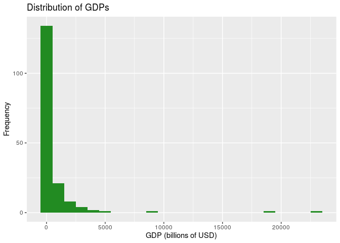
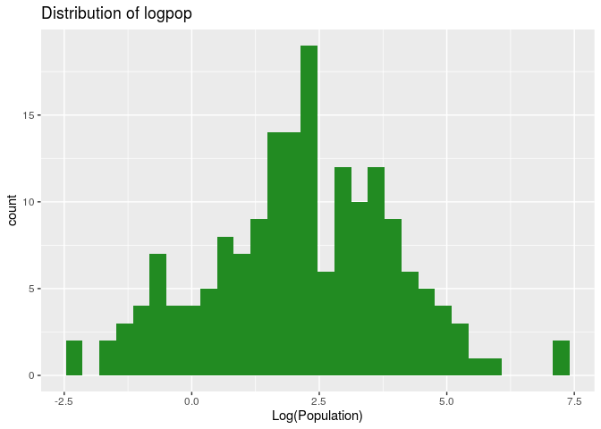
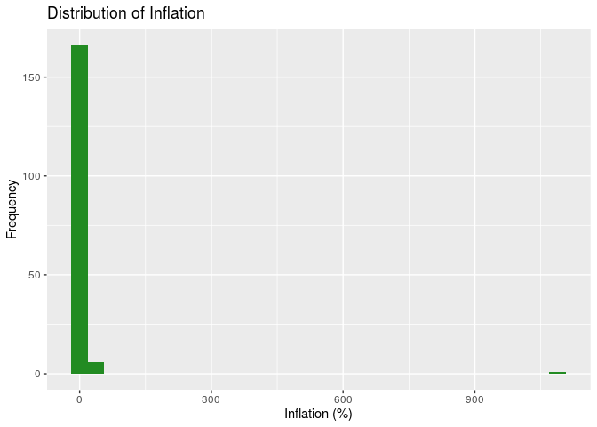

What Makes a Strong GDP?
================
Rtists
11/14/2019

    ## ── Attaching packages ──────────────────────────────────────────────────────────────────────── tidyverse 1.2.1 ──

    ## ✔ ggplot2 3.2.1     ✔ purrr   0.3.2
    ## ✔ tibble  2.1.3     ✔ dplyr   0.8.3
    ## ✔ tidyr   0.8.3     ✔ stringr 1.4.0
    ## ✔ readr   1.3.1     ✔ forcats 0.4.0

    ## ── Conflicts ─────────────────────────────────────────────────────────────────────────── tidyverse_conflicts() ──
    ## ✖ dplyr::filter() masks stats::filter()
    ## ✖ dplyr::lag()    masks stats::lag()

    ## 
    ## Attaching package: 'skimr'

    ## The following object is masked from 'package:stats':
    ## 
    ##     filter

    ## 
    ## Attaching package: 'magrittr'

    ## The following object is masked from 'package:purrr':
    ## 
    ##     set_names

    ## The following object is masked from 'package:tidyr':
    ## 
    ##     extract

    ## 
    ## Attaching package: 'knitr'

    ## The following object is masked from 'package:skimr':
    ## 
    ##     kable

    ## Loading required package: Hmisc

    ## Loading required package: lattice

    ## Loading required package: survival

    ## Loading required package: Formula

    ## 
    ## Attaching package: 'Hmisc'

    ## The following objects are masked from 'package:dplyr':
    ## 
    ##     src, summarize

    ## The following objects are masked from 'package:base':
    ## 
    ##     format.pval, units

    ## Loading required package: SparseM

    ## 
    ## Attaching package: 'SparseM'

    ## The following object is masked from 'package:base':
    ## 
    ##     backsolve

Your regression analysis results go here. At a minimum, the regression
analysis should include the following:

  - Statement of the research question and modeling obejctive
    (prediction, inference, etc.)
  - Description of the response variable
  - Updated exploratory data analysis, incorporating any feedback from
    the proposal
  - Explanation of the modeling process and why you chose those metohds,
    incorporating any feedback from the proposal
  - Output of the final model
  - Discussion of the assumptions for the final model
  - Interpretations / interesting findings from the model coefficients
  - Additional work of other models or analylsis not included in the
    final model.

*Use proper headings as needed.*

### Question and Objective

In this investigation, our goal is to try to understand what aspects of
a country’s economy are most associated with the GDP of the country. GDP
is one of the most foundational measures of economic growth and the size
of an economy, and as a result the majority of governments are extremely
interested in understanding what contributes to having a large GDP. This
study tries to help governments answer that question by investigating
the research question: “What indicators of a country’s economy have the
greatest effect on the country’s GDP?”

Since we already have data on all the countries and are thus don’t need
to try to “predict” the GDP of a country that may not be in our dataset,
our modeling objective isn’t prediction but rather inference, since we
are trying to understand which predictor variable has the greatest
effect on the response. Additionally, the modeling objective is
inference as we are using our data set to build a model that reliably
chooses the correct identifiers of GDP from a set of more variables than
we may potentially need.

### Response Variable

In our investigation, the response value is GDP; that is, we are trying
to determine the effect of various predictors on the GDP of countries.
GDP represents the final value of all finished goods and services
produced in a country in 2019, and in this case, in US dollars. However,
according to the EDA conducted below, since the distribution of GDP’s is
incredibly right-skewed (countries such as the US and China have
enormous GDP’s matched by no other countries), we will be building the
model using the log of GDP as our response.

### Exploratory Data Analysis

We will begin our exploratory data analysis by cleaning the data. We
notice a total of 12 countries which have a “NA” value for one or more
of the predictor variables that we will investigate. We will omit these
entries from our analysis, but we expect this to add a slight bias to
our results; the below 12 countries are all developing and thus our
model may fit developed countries better than developing countries.
However, the 12 countries below also have unusual governmental and
economic structures as well as poor data quality associated with them;
including them in the model may also significantly influence the
coefficients associated with predictors. Thus, we have decided to leave
them out of the model.

    ## # A tibble: 12 x 1
    ##    Country      
    ##    <chr>        
    ##  1 Dominica     
    ##  2 Iraq         
    ##  3 Kiribati     
    ##  4 Korea, North 
    ##  5 Kosovo       
    ##  6 Libya        
    ##  7 Liechtenstein
    ##  8 Micronesia   
    ##  9 Seychelles   
    ## 10 Somalia      
    ## 11 Syria        
    ## 12 Yemen

### Response Variable

Now that the data has been cleaned, we can begin exploring our response
variable.

<!-- -->

    ## Skim summary statistics
    ##  n obs: 173 
    ##  n variables: 1 
    ## 
    ## ── Variable type:numeric ────────────────────────────────────────────────────────────────────────────────────────
    ##  variable missing complete   n   mean      sd  p0  p25  p50   p75    p100
    ##       GDP       0      173 173 729.71 2486.04 0.6 28.3 88.9 439.6 23159.1
    ##      hist
    ##  ▇▁▁▁▁▁▁▁

The distribution of GDP shows significant right skew, which is
reasonable and expected as the world has countries such as the US and
China who, due to their population and industrial advantages, have
significantly greater GDP’s than the average country. We will now show a
graph of GDP with some of these influential points
    removed.

    ## `stat_bin()` using `bins = 30`. Pick better value with `binwidth`.

<!-- -->

    ## Skim summary statistics
    ##  n obs: 173 
    ##  n variables: 1 
    ## 
    ## ── Variable type:numeric ────────────────────────────────────────────────────────────────────────────────────────
    ##  variable missing complete   n   mean      sd  p0  p25  p50   p75    p100
    ##       GDP       0      173 173 729.71 2486.04 0.6 28.3 88.9 439.6 23159.1
    ##      hist
    ##  ▇▁▁▁▁▁▁▁

The distribution of GDP is unimodal and right-skewed. Since the media
and interquartile range are less influenced by outliers, we report them
as measures of center and spread. The median of the distribution is 88.9
billion and the interquartile range is 411.3. THe values are in billions
of dollars.

This calls for a log-transform of the response variable, whose
distribution is visualized below:

<!-- -->

    ## Skim summary statistics
    ##  n obs: 173 
    ##  n variables: 1 
    ## 
    ## ── Variable type:numeric ────────────────────────────────────────────────────────────────────────────────────────
    ##  variable missing complete   n mean   sd    p0  p25  p50  p75  p100
    ##    logGDP       0      173 173 4.61 2.08 -0.51 3.34 4.49 6.09 10.05
    ##      hist
    ##  ▁▃▅▇▆▅▂▁

This distribution of logGDP is normal and unimodal. We will likely use
this as our response variable. Since there is minimal skewing and the
distribution is generally symmetric, we report the mean and standard
deviation as measures of center and spread. The mean logGDP is 4.61 and
the standard deviation of its distribution is 2.08.

### Predictor Variables

We will now look at each of the 12 predictor variables that we will use
to predict GDP, starting with `TaxBurden`.

<!-- -->

    ## Skim summary statistics
    ##  n obs: 173 
    ##  n variables: 1 
    ## 
    ## ── Variable type:numeric ────────────────────────────────────────────────────────────────────────────────────────
    ##   variable missing complete   n  mean    sd  p0 p25  p50  p75 p100
    ##  TaxBurden       0      173 173 22.19 10.25 1.6  14 20.7 30.2   47
    ##      hist
    ##  ▂▅▇▆▅▅▂▂

`TaxBurden` represents the amount of tax paid by the citizens of a
country as a proportion of the GDP of that country. The distribution of
tax burden is unimodal and only slightly right skewed. The mode is
around 14-15%. In general, the tax burden across countries appears
normally distributed. The mean tax burden is 22.19 and the standard
deviation of the distribution is
10.17.

<!-- -->

    ## Skim summary statistics
    ##  n obs: 173 
    ##  n variables: 1 
    ## 
    ## ── Variable type:numeric ────────────────────────────────────────────────────────────────────────────────────────
    ##     variable missing complete   n mean    sd   p0  p25  p50  p75 p100
    ##  GovSpending       0      173 173 32.2 10.67 10.6 23.6 31.6 39.8 64.2
    ##      hist
    ##  ▂▇▇▇▇▃▁▁

`GovSpending` represents the amount spent by the government as a
percentage of the GDP of the country. The distribution of government
spending is generally symmmetric and unimodal. There are several
outliers which have significantly higher government spending: with
government spending either equal to or more than 100% of the country’s
GDP. The mode of the distribution is around 25%. Since there is minimal
skewing, we report the mean and standard deviation. The mean government
spending is 33.87 and the distribution has a standard deviation of
15.52.

<!-- -->

    ## Skim summary statistics
    ##  n obs: 173 
    ##  n variables: 1 
    ## 
    ## ── Variable type:numeric ────────────────────────────────────────────────────────────────────────────────────────
    ##    variable missing complete   n  mean     sd  p0 p25 p50  p75   p100
    ##  Population       0      173 173 42.16 149.89 0.1 2.9 9.5 31.4 1390.1
    ##      hist
    ##  ▇▁▁▁▁▁▁▁

`Population` represents the number of individuals living in a country.
The distribution of population is unimodal and right-skewed. Because
there are two influential points in “population”, we will plot another
graph of population without these two points
below.

<!-- -->

    ## Skim summary statistics
    ##  n obs: 173 
    ##  n variables: 1 
    ## 
    ## ── Variable type:numeric ────────────────────────────────────────────────────────────────────────────────────────
    ##    variable missing complete   n  mean     sd  p0 p25 p50  p75   p100
    ##  Population       0      173 173 42.16 149.89 0.1 2.9 9.5 31.4 1390.1
    ##      hist
    ##  ▇▁▁▁▁▁▁▁

The distribution of population is unimodal and right-skewed. The mode of
the distribution is around 1 million. Since the median and IQR are more
robust to skewing, we report them instead as a measures of center and
spread. The median is 9.15 and the IQR is 26.85. Additionally, when
conducting our analysis, we may need to apply a log-transform to make
the distribution of the variable more normal; based on a pairs plot,
population has a logarithmic relationship with logGDP and thus we will
apply a logarithmic transform to population
    below.

    ## `stat_bin()` using `bins = 30`. Pick better value with `binwidth`.

<!-- -->

Based on the above plot, the logarithmic transformation has been
successful in normalizing the population variable as well as creating a
more linear relationship with GDP.

<!-- -->

    ## Skim summary statistics
    ##  n obs: 173 
    ##  n variables: 1 
    ## 
    ## ── Variable type:numeric ────────────────────────────────────────────────────────────────────────────────────────
    ##      variable missing complete   n mean   sd  p0 p25 p50 p75 p100     hist
    ##  Unemployment       0      173 173 7.27 5.67 0.1 3.7 5.5 9.3 27.3 ▆▇▅▂▁▁▁▁

`Unemployment` represents the percantage of the workforce of a country
that is currently not working. The distribution of unemployment is
unimodal and right-skewed. The mode of the distribution is around 4-5%.
Since the median and IQR are more robust to skewing, we report them
instead as a measures of center and spread. The median is 5.7 and the
IQR is
    5.6.

    ## `stat_bin()` using `bins = 30`. Pick better value with `binwidth`.

<!-- --><!-- -->

    ## Skim summary statistics
    ##  n obs: 173 
    ##  n variables: 1 
    ## 
    ## ── Variable type:numeric ────────────────────────────────────────────────────────────────────────────────────────
    ##   variable missing complete   n  mean    sd   p0 p25 p50 p75   p100
    ##  Inflation       0      173 173 10.87 82.56 -0.9 1.3 2.8 5.5 1087.5
    ##      hist
    ##  ▇▁▁▁▁▁▁▁

`Inflation` represents the change in prices of goods and services in a
year in the country. The first distribution of inflation rates includes
all outliers. Because of the size and resolution of the diagram, the
distribution of most economies are not visible. The second diagram shows
the distribution of inflation rates without the outlier with more than
1000% inflation. The distribution of inflation rate is generally
unimodal and right skewed. The mode of the distribution is around 2%.
Given significant skewing, we report the median and IQR as measures of
center and spread. The median inflation rate is 2.7% and the IQR is 4%.
Because of this skew, we may need to log-transform this variable as well
to get its distribution to be more
normal.

<!-- --><!-- -->

`Region` represents the geographical continent/area that the country is
situated in. The bar graph and piechart of `Region` shows that there is
a relatively equal representation of countries from different regions of
the world. The Americas, Asia-Pacific, Sub-Saharan Africa, and Europe
each represent around 25% of all the countries in the data. The smallest
representation is from the Middle East and North Africa at 8.1%. We are
not too concerned with the distribution because there are 195 countries
in the world and our data has 173 countries. The difference in
distribution across region is likely to be largely reflective of the
actual geographical distribution of
nation-states.

<!-- -->

`GovInterference` represents the amount of interference that the
government has in the economy as determined by the World Economic Index.
The distribution of government interference shows that most countries
either have extensive or moderate government inteference. The mode of
the distribution is moderate government interference. Economies with
limited and repressive intervention are significanly lesser, each having
around 10-15 countries. We do not report the center or spread here
because government interference is a categorical variable.

<!-- -->

    ## Skim summary statistics
    ##  n obs: 173 
    ##  n variables: 1 
    ## 
    ## ── Variable type:numeric ────────────────────────────────────────────────────────────────────────────────────────
    ##    variable missing complete   n mean  sd p0 p25 p50 p75 p100     hist
    ##  TariffRate       0      173 173 5.61 4.4  0   2 4.2 8.7 18.6 ▇▅▃▃▃▁▁▁

`TariffRate` represents the average percentage tax on imports that the
country has outstanding as of 2019. The distribution of tariff rate is
generally right skewed and unimodal. There are several outlier economies
with 50% tariff rate such as Central African Republic and North Korea.
The mode of the distribution is around 2%. The median tariff rate is 4.3
and the interquartile range of the distribution is 6.7. Because of this
right-skew, log-transforming this variable might be
necessary.

<!-- -->

    ## Skim summary statistics
    ##  n obs: 173 
    ##  n variables: 1 
    ## 
    ## ── Variable type:numeric ────────────────────────────────────────────────────────────────────────────────────────
    ##       variable missing complete   n  mean    sd p0 p25 p50 p75 p100
    ##  IncomeTaxRate       0      173 173 28.78 13.32  0  20  30  35   60
    ##      hist
    ##  ▂▅▂▇▇▅▂▁

`IncomeTaxRate` represents the average tax rate applied to individuals
on their incomes. The distribution of income tax rate is unimodal and
generally symmetric. While its general shape resembles a normal
distribution, there are several values of income tax rate which have
particularly high frequency such as 10%, 25% and 34-35%. The mode of the
distribution occurs at 35%. Since there is relatively minimal skewing,
we report the mean and standard deviation as measures of center and
spread. The mean income tax rate is 28.23 and the standard deviation of
the distribution is
13.4.

<!-- -->

    ## Skim summary statistics
    ##  n obs: 173 
    ##  n variables: 1 
    ## 
    ## ── Variable type:numeric ────────────────────────────────────────────────────────────────────────────────────────
    ##          variable missing complete   n  mean   sd p0 p25 p50 p75 p100
    ##  CorporateTaxRate       0      173 173 23.95 8.89  0  20  25  30   50
    ##      hist
    ##  ▁▂▂▇▆▂▁▁

`CorporateTaxRate` represents the average tax rate applied to
corporations on their revenues. The distribution of corporate tax rate
is unimodal and only slightly right skewed. The mode of the distribution
is around 28-30%. Since there is minimal skewing, we report the mean and
the standard deviation as measures of center and spread. The mean
corporate tax rate is 23.89% and the standard deviation is 8.88%.

<!-- -->

    ## Skim summary statistics
    ##  n obs: 173 
    ##  n variables: 1 
    ## 
    ## ── Variable type:numeric ────────────────────────────────────────────────────────────────────────────────────────
    ##    variable missing complete   n  mean   sd p0  p25  p50  p75  p100
    ##  PublicDebt       0      173 173 56.46 33.8  0 35.2 49.4 69.9 236.4
    ##      hist
    ##  ▃▇▃▂▁▁▁▁

`PublicDebt` represents the debt of the country as a percentage of the
country’s GDP. The distribution of public debt is unimodal and right
skewed. There are several outliers with public debt more than 175%. The
mode of the distribution is around 30%. The median public debt is 49.4%
and the interquartile range is 35%.

    ## # A tibble: 4 x 2
    ## # Groups:   cat_inflation [4]
    ##   cat_inflation        n
    ##   <chr>            <int>
    ## 1 Dangerously High    39
    ## 2 Healthy             62
    ## 3 High                42
    ## 4 Low                 30

<!-- -->

    ## Skim summary statistics
    ##  n obs: 173 
    ##  n variables: 18 
    ## 
    ## ── Variable type:character ──────────────────────────────────────────────────────────────────────────────────────
    ##         variable missing complete   n min max empty n_unique
    ##          Country       0      173 173   4  32     0      173
    ##  GovInterference       0      173 173   7  10     0        4
    ##           Region       0      173 173   6  28     0        5
    ## 
    ## ── Variable type:factor ─────────────────────────────────────────────────────────────────────────────────────────
    ##       variable missing complete   n n_unique
    ##  cat_inflation       0      173 173        4
    ##                          top_counts ordered
    ##  Hea: 62, Hig: 42, Dan: 39, Low: 30   FALSE
    ## 
    ## ── Variable type:numeric ────────────────────────────────────────────────────────────────────────────────────────
    ##          variable missing complete   n     mean       sd     p0     p25
    ##  CorporateTaxRate       0      173 173    23.95     8.89   0      20   
    ##               GDP       0      173 173   729.71  2486.04   0.6    28.3 
    ##         GDPGrowth       0      173 173     3.27     2.75 -14       2   
    ##         GDPperCap       0      173 173 21333.3  22707.37 677    4729   
    ##       GovSpending       0      173 173    32.2     10.67  10.6    23.6 
    ##     IncomeTaxRate       0      173 173    28.78    13.32   0      20   
    ##         Inflation       0      173 173    10.87    82.56  -0.9     1.3 
    ##            logGDP       0      173 173     4.61     2.08  -0.51    3.34
    ##            logpop       0      173 173     2.16     1.8   -2.3     1.06
    ##        Population       0      173 173    42.16   149.89   0.1     2.9 
    ##        PublicDebt       0      173 173    56.46    33.8    0      35.2 
    ##        TariffRate       0      173 173     5.61     4.4    0       2   
    ##         TaxBurden       0      173 173    22.19    10.25   1.6    14   
    ##      Unemployment       0      173 173     7.27     5.67   0.1     3.7 
    ##       p50      p75      p100     hist
    ##     25       30        50    ▁▂▂▇▆▂▁▁
    ##     88.9    439.6   23159.1  ▇▁▁▁▁▁▁▁
    ##      3.2      4.8      10.9  ▁▁▁▁▂▇▃▁
    ##  12920    31139    124529    ▇▃▂▁▁▁▁▁
    ##     31.6     39.8      64.2  ▂▇▇▇▇▃▁▁
    ##     30       35        60    ▂▅▂▇▇▅▂▁
    ##      2.8      5.5    1087.5  ▇▁▁▁▁▁▁▁
    ##      4.49     6.09     10.05 ▁▃▅▇▆▅▂▁
    ##      2.25     3.45      7.24 ▁▃▃▇▆▃▁▁
    ##      9.5     31.4    1390.1  ▇▁▁▁▁▁▁▁
    ##     49.4     69.9     236.4  ▃▇▃▂▁▁▁▁
    ##      4.2      8.7      18.6  ▇▅▃▃▃▁▁▁
    ##     20.7     30.2      47    ▂▅▇▆▅▅▂▂
    ##      5.5      9.3      27.3  ▆▇▅▂▁▁▁▁

### Methods & Modelling

``` r
economic_data <- economic_data %>%
  mutate(cat_inflation = relevel(cat_inflation, ref = "Healthy", ordered = FALSE))
```

``` r
aic_full_model <- lm(logGDP ~ TariffRate + logpop + Unemployment + cat_inflation + PublicDebt + GovSpendingCent + IncomeTaxRate + CorporateTaxRate + TaxBurdenCent + GDPGrowth, data = economic_data)

aic_model <- step(aic_full_model, direction = "backward")
```

    ## Start:  AIC=-47.56
    ## logGDP ~ TariffRate + logpop + Unemployment + cat_inflation + 
    ##     PublicDebt + GovSpendingCent + IncomeTaxRate + CorporateTaxRate + 
    ##     TaxBurdenCent + GDPGrowth
    ## 
    ##                    Df Sum of Sq    RSS     AIC
    ## - PublicDebt        1      0.42 113.50 -48.923
    ## - IncomeTaxRate     1      0.74 113.82 -48.431
    ## <none>                          113.08 -47.562
    ## - GovSpendingCent   1      2.27 115.35 -46.125
    ## - Unemployment      1      2.54 115.62 -45.712
    ## - CorporateTaxRate  1      8.38 121.46 -37.197
    ## - cat_inflation     3     11.96 125.04 -36.166
    ## - TaxBurdenCent     1      9.67 122.75 -35.361
    ## - GDPGrowth         1     15.35 128.43 -27.537
    ## - TariffRate        1     22.68 135.76 -17.940
    ## - logpop            1    457.55 570.63 230.465
    ## 
    ## Step:  AIC=-48.92
    ## logGDP ~ TariffRate + logpop + Unemployment + cat_inflation + 
    ##     GovSpendingCent + IncomeTaxRate + CorporateTaxRate + TaxBurdenCent + 
    ##     GDPGrowth
    ## 
    ##                    Df Sum of Sq    RSS     AIC
    ## - IncomeTaxRate     1      0.62 114.11 -49.984
    ## <none>                          113.50 -48.923
    ## - GovSpendingCent   1      2.14 115.64 -47.684
    ## - Unemployment      1      2.27 115.77 -47.491
    ## - CorporateTaxRate  1      8.54 122.04 -38.368
    ## - cat_inflation     3     12.06 125.55 -37.455
    ## - TaxBurdenCent     1      9.81 123.31 -36.576
    ## - GDPGrowth         1     15.32 128.82 -29.014
    ## - TariffRate        1     22.29 135.78 -19.904
    ## - logpop            1    461.19 574.69 229.693
    ## 
    ## Step:  AIC=-49.98
    ## logGDP ~ TariffRate + logpop + Unemployment + cat_inflation + 
    ##     GovSpendingCent + CorporateTaxRate + TaxBurdenCent + GDPGrowth
    ## 
    ##                    Df Sum of Sq    RSS     AIC
    ## <none>                          114.11 -49.984
    ## - GovSpendingCent   1      1.98 116.10 -49.002
    ## - Unemployment      1      2.10 116.21 -48.837
    ## - cat_inflation     3     11.44 125.56 -39.453
    ## - TaxBurdenCent     1      9.49 123.60 -38.163
    ## - GDPGrowth         1     15.05 129.16 -30.555
    ## - CorporateTaxRate  1     16.53 130.64 -28.584
    ## - TariffRate        1     23.14 137.26 -20.039
    ## - logpop            1    510.45 624.56 242.090

``` r
tidy(aic_model, conf.int="TRUE") %>%
  kable(format="markdown", conf.level = 0.95)
```

| term                           |    estimate | std.error |   statistic |   p.value |    conf.low |   conf.high |
| :----------------------------- | ----------: | --------: | ----------: | --------: | ----------: | ----------: |
| (Intercept)                    |   4.6907537 | 0.2756796 |  17.0152344 | 0.0000000 |   4.1463648 |   5.2351427 |
| TariffRate                     | \-0.0963879 | 0.0168162 | \-5.7318361 | 0.0000000 | \-0.1295952 | \-0.0631806 |
| logpop                         |   1.0495934 | 0.0389904 |  26.9193045 | 0.0000000 |   0.9725985 |   1.1265883 |
| Unemployment                   | \-0.0223660 | 0.0129689 | \-1.7245935 | 0.0865081 | \-0.0479759 |   0.0032438 |
| cat\_inflationDangerously High | \-0.6621879 | 0.1924214 | \-3.4413429 | 0.0007364 | \-1.0421654 | \-0.2822104 |
| cat\_inflationHigh             | \-0.4574688 | 0.1802102 | \-2.5385286 | 0.0120748 | \-0.8133327 | \-0.1016048 |
| cat\_inflationLow              |   0.0052852 | 0.1944943 |   0.0271743 | 0.9783542 | \-0.3787857 |   0.3893562 |
| GovSpendingCent                | \-0.0176033 | 0.0104889 | \-1.6782754 | 0.0952214 | \-0.0383160 |   0.0031093 |
| CorporateTaxRate               | \-0.0405577 | 0.0083728 | \-4.8439745 | 0.0000030 | \-0.0570916 | \-0.0240238 |
| TaxBurdenCent                  |   0.0405295 | 0.0110418 |   3.6705696 | 0.0003282 |   0.0187252 |   0.0623338 |
| GDPGrowth                      | \-0.1242708 | 0.0268870 | \-4.6219609 | 0.0000077 | \-0.1773651 | \-0.0711766 |

``` r
regfit_backward <- regsubsets(logGDP ~ TariffRate + logpop + Unemployment + cat_inflation + PublicDebt + GovSpendingCent + IncomeTaxRate + CorporateTaxRate + TaxBurdenCent + GDPGrowth, data = economic_data, method="backward")

sel_summary <- summary(regfit_backward)
coef(regfit_backward, which.min(sel_summary$bic))
```

    ##                   (Intercept)                    TariffRate 
    ##                    4.33280295                   -0.09611387 
    ##                        logpop cat_inflationDangerously High 
    ##                    1.05841583                   -0.72166023 
    ##             cat_inflationHigh              CorporateTaxRate 
    ##                   -0.48672687                   -0.03596846 
    ##                 TaxBurdenCent                     GDPGrowth 
    ##                    0.02364809                   -0.09788876

``` r
sel_summary <- summary(regfit_backward)
coef(regfit_backward, which.max(sel_summary$adjr2))
```

    ##                   (Intercept)                    TariffRate 
    ##                    4.46682869                   -0.09495813 
    ##                        logpop                  Unemployment 
    ##                    1.05108391                   -0.01767904 
    ## cat_inflationDangerously High             cat_inflationHigh 
    ##                   -0.66991672                   -0.45045459 
    ##              CorporateTaxRate                 TaxBurdenCent 
    ##                   -0.03568516                    0.02722611 
    ##                     GDPGrowth 
    ##                   -0.10505194

AIC: logGDP ~ TariffRate + logpop + CorporateTaxRate + TaxBurdenCent +
GDPGrowth + Unemployment + GovSpendingCent +
cat\_inflationDangerouslyHigh + cat\_inflationHigh + cat\_inflationLow

BIC: logGDP ~ TariffRate + logpop + CorporateTaxRate + TaxBurdenCent +
GDPGrowth + cat\_inflationDangerouslyHigh + cat\_inflationHigh

adjR2: logGDP ~ TariffRate + logpop + CorporateTaxRate + TaxBurdenCent +
GDPGrowth + Unemployment + cat\_inflationDangerously High +
cat\_inflationHigh

From the final equations generated using different selection criteria,
we see that all three selection criteria included TariffRate + logpop +
CorporateTaxRate + TaxBurdenCent + GDPGrowth in the final model.
cat\_inflation is included in all three equations, though for BIC and
adjR2, the level of low inflation is excluded. This is not surprising
considering that the p-value of the cat\_inflationLow coefficient is
0.9783542, implying that this coefficient is statistically
insignificant. We will choose to include cat\_inflation in the final
model for the following reasons. One, a categorical variable with 4
levels require us to use 3 dummy variables. Removing one because it is
insignificant will affect the coefficients of the other levels because
the missing level has to be forcibly added to either of the three
category. We will also not change the categories of inflation rates
because the present classification references economic literature which
generally suggests four levels of inflation rates: low, healthy, high,
and dangerously high (hyperinflation). Two, we also note that the AIC
coefficient for cat\_inflationLow to be extremely small. This means that
the regression model only made very minimal changes to fit the data
categorized as Low inflation, thus we are not too concerned that the
inclusion of this level will significantly impact the accuracy of the
regression.

Unemployment is only shown in the AIC equation while GovSpendingCent is
included in both the AIC and adjR2 equations. We conduct a nested F test
to finally decide if these two predictor variables are significant to
the existing
model.

``` r
reduced <- lm(logGDP ~ TariffRate + logpop + CorporateTaxRate + TaxBurdenCent + GDPGrowth + cat_inflation, data = economic_data)
full <- lm(logGDP ~ TariffRate + logpop + CorporateTaxRate + TaxBurdenCent + GDPGrowth + cat_inflation + Unemployment, data = economic_data)
kable(anova(reduced, full), format="markdown", digits = 3)
```

| Res.Df |     RSS | Df | Sum of Sq |     F | Pr(\>F) |
| -----: | ------: | -: | --------: | ----: | ------: |
|    164 | 117.472 | NA |        NA |    NA |      NA |
|    163 | 116.098 |  1 |     1.374 | 1.929 |   0.167 |

``` r
reduced <- lm(logGDP ~ TariffRate + logpop + CorporateTaxRate + TaxBurdenCent + GDPGrowth + cat_inflation, data = economic_data)
full <- lm(logGDP ~ TariffRate + logpop + CorporateTaxRate + TaxBurdenCent + GDPGrowth + cat_inflation + GovSpendingCent, data = economic_data)
kable(anova(reduced, full), format="markdown", digits = 3)
```

| Res.Df |     RSS | Df | Sum of Sq |     F | Pr(\>F) |
| -----: | ------: | -: | --------: | ----: | ------: |
|    164 | 117.472 | NA |        NA |    NA |      NA |
|    163 | 116.209 |  1 |     1.263 | 1.771 |   0.185 |

As observed in the individual nested F tests of GovSpendingCent and
Unemployment, both variables have relatively high p-values. This means
that both predictor variables are not statistically significant
predictors. We also do not accord them high practical significance for
the following reasons. While unemployment does affect and is affected by
gdp growth rate, it theoretically may not have considerable impact on
GDP (GDP is a stock concept, gdp growth is a flow concept). This is not
surprising since countries with high GDP may have high or low
unemployment depending on their respective trajectories in the business
cycle. The role of government spending is also highly contested in
economic literature. That it is not a significant determinant of GDP
reflect this ambuiguity in academic
literature.

``` r
reduced <- lm(logGDP ~ TariffRate + logpop + CorporateTaxRate + TaxBurdenCent + GDPGrowth + cat_inflation, data = economic_data)
full <- lm(logGDP ~ TariffRate + logpop + CorporateTaxRate + TaxBurdenCent + GDPGrowth + cat_inflation + cat_inflation*GDPGrowth, data = economic_data)
kable(anova(reduced, full), format="markdown", digits = 3)
```

| Res.Df |     RSS | Df | Sum of Sq |     F | Pr(\>F) |
| -----: | ------: | -: | --------: | ----: | ------: |
|    164 | 117.472 | NA |        NA |    NA |      NA |
|    161 | 116.476 |  3 |     0.996 | 0.459 |   0.711 |

``` r
reduced <- lm(logGDP ~ TariffRate + logpop + CorporateTaxRate + TaxBurdenCent + GDPGrowth + cat_inflation, data = economic_data)
full <- lm(logGDP ~ TariffRate + logpop + CorporateTaxRate + TaxBurdenCent + GDPGrowth + cat_inflation + cat_inflation*CorporateTaxRate, data = economic_data)
kable(anova(reduced, full), format="markdown", digits = 3)
```

| Res.Df |     RSS | Df | Sum of Sq |     F | Pr(\>F) |
| -----: | ------: | -: | --------: | ----: | ------: |
|    164 | 117.472 | NA |        NA |    NA |      NA |
|    161 | 113.120 |  3 |     4.352 | 2.065 |   0.107 |

``` r
reduced <- lm(logGDP ~ TariffRate + logpop + CorporateTaxRate + TaxBurdenCent + GDPGrowth + cat_inflation, data = economic_data)
full <- lm(logGDP ~ TariffRate + logpop + CorporateTaxRate + TaxBurdenCent + GDPGrowth + cat_inflation + cat_inflation*CorporateTaxRate, data = economic_data)
kable(anova(reduced, full), format="markdown", digits = 3)
```

| Res.Df |     RSS | Df | Sum of Sq |     F | Pr(\>F) |
| -----: | ------: | -: | --------: | ----: | ------: |
|    164 | 117.472 | NA |        NA |    NA |      NA |
|    161 | 113.120 |  3 |     4.352 | 2.065 |   0.107 |

``` r
reduced <- lm(logGDP ~ TariffRate + logpop + CorporateTaxRate + TaxBurdenCent + GDPGrowth + cat_inflation, data = economic_data)
full <- lm(logGDP ~ TariffRate + logpop + CorporateTaxRate + TaxBurdenCent + GDPGrowth + cat_inflation + cat_inflation*logpop, data = economic_data)
kable(anova(reduced, full), format="markdown", digits = 3)
```

| Res.Df |     RSS | Df | Sum of Sq |     F | Pr(\>F) |
| -----: | ------: | -: | --------: | ----: | ------: |
|    164 | 117.472 | NA |        NA |    NA |      NA |
|    161 | 114.625 |  3 |     2.847 | 1.333 |   0.266 |

``` r
reduced <- lm(logGDP ~ TariffRate + logpop + CorporateTaxRate + TaxBurdenCent + GDPGrowth + cat_inflation, data = economic_data)
full <- lm(logGDP ~ TariffRate + logpop + CorporateTaxRate + TaxBurdenCent + GDPGrowth + cat_inflation + cat_inflation*TariffRate, data = economic_data)
kable(anova(reduced, full), format="markdown", digits = 3)
```

| Res.Df |     RSS | Df | Sum of Sq |     F | Pr(\>F) |
| -----: | ------: | -: | --------: | ----: | ------: |
|    164 | 117.472 | NA |        NA |    NA |      NA |
|    161 | 113.397 |  3 |     4.075 | 1.929 |   0.127 |

### Final Model

``` r
final_model <- lm(logGDP ~ TariffRate + logpop + CorporateTaxRate + TaxBurdenCent + GDPGrowth + cat_inflation, data=economic_data)
kable(tidy(final_model,conf.int=TRUE),format="html",digits=3)
```

<table>

<thead>

<tr>

<th style="text-align:left;">

term

</th>

<th style="text-align:right;">

estimate

</th>

<th style="text-align:right;">

std.error

</th>

<th style="text-align:right;">

statistic

</th>

<th style="text-align:right;">

p.value

</th>

<th style="text-align:right;">

conf.low

</th>

<th style="text-align:right;">

conf.high

</th>

</tr>

</thead>

<tbody>

<tr>

<td style="text-align:left;">

(Intercept)

</td>

<td style="text-align:right;">

4.334

</td>

<td style="text-align:right;">

0.224

</td>

<td style="text-align:right;">

19.376

</td>

<td style="text-align:right;">

0.000

</td>

<td style="text-align:right;">

3.892

</td>

<td style="text-align:right;">

4.776

</td>

</tr>

<tr>

<td style="text-align:left;">

TariffRate

</td>

<td style="text-align:right;">

\-0.096

</td>

<td style="text-align:right;">

0.017

</td>

<td style="text-align:right;">

\-5.681

</td>

<td style="text-align:right;">

0.000

</td>

<td style="text-align:right;">

\-0.129

</td>

<td style="text-align:right;">

\-0.063

</td>

</tr>

<tr>

<td style="text-align:left;">

logpop

</td>

<td style="text-align:right;">

1.058

</td>

<td style="text-align:right;">

0.039

</td>

<td style="text-align:right;">

27.175

</td>

<td style="text-align:right;">

0.000

</td>

<td style="text-align:right;">

0.981

</td>

<td style="text-align:right;">

1.135

</td>

</tr>

<tr>

<td style="text-align:left;">

CorporateTaxRate

</td>

<td style="text-align:right;">

\-0.036

</td>

<td style="text-align:right;">

0.008

</td>

<td style="text-align:right;">

\-4.543

</td>

<td style="text-align:right;">

0.000

</td>

<td style="text-align:right;">

\-0.052

</td>

<td style="text-align:right;">

\-0.020

</td>

</tr>

<tr>

<td style="text-align:left;">

TaxBurdenCent

</td>

<td style="text-align:right;">

0.024

</td>

<td style="text-align:right;">

0.007

</td>

<td style="text-align:right;">

3.246

</td>

<td style="text-align:right;">

0.001

</td>

<td style="text-align:right;">

0.009

</td>

<td style="text-align:right;">

0.038

</td>

</tr>

<tr>

<td style="text-align:left;">

GDPGrowth

</td>

<td style="text-align:right;">

\-0.098

</td>

<td style="text-align:right;">

0.024

</td>

<td style="text-align:right;">

\-4.082

</td>

<td style="text-align:right;">

0.000

</td>

<td style="text-align:right;">

\-0.145

</td>

<td style="text-align:right;">

\-0.051

</td>

</tr>

<tr>

<td style="text-align:left;">

cat\_inflationDangerously High

</td>

<td style="text-align:right;">

\-0.723

</td>

<td style="text-align:right;">

0.191

</td>

<td style="text-align:right;">

\-3.795

</td>

<td style="text-align:right;">

0.000

</td>

<td style="text-align:right;">

\-1.099

</td>

<td style="text-align:right;">

\-0.347

</td>

</tr>

<tr>

<td style="text-align:left;">

cat\_inflationHigh

</td>

<td style="text-align:right;">

\-0.488

</td>

<td style="text-align:right;">

0.180

</td>

<td style="text-align:right;">

\-2.712

</td>

<td style="text-align:right;">

0.007

</td>

<td style="text-align:right;">

\-0.843

</td>

<td style="text-align:right;">

\-0.133

</td>

</tr>

<tr>

<td style="text-align:left;">

cat\_inflationLow

</td>

<td style="text-align:right;">

\-0.004

</td>

<td style="text-align:right;">

0.196

</td>

<td style="text-align:right;">

\-0.019

</td>

<td style="text-align:right;">

0.985

</td>

<td style="text-align:right;">

\-0.391

</td>

<td style="text-align:right;">

0.383

</td>

</tr>

</tbody>

</table>

#### Model Diagnostics

After we have the model built up, the next task is to examine the model
assumptions: linearity, constant variance, normality, and independence.
We can see from the scatterplot matrix of response variable vs. every
predictor variable that there is indeed some linear relationship between
them after twe take log transformation of suspicious variables like
population. So, the linearity assumption is satisfied. Now we plot the
residuals to check for constant variance
assumption.

<!-- -->

This is the scatterplot of residuals vs. predicted GDP values. There
doen’t seem to be a distinguishable shape. The residuals appear to
randomly scattered in the plot.

Then we plot the residuals vs. each predictor variable to further check
for constant variance
assumption.

<!-- --><!-- --><!-- --><!-- --><!-- -->

<!-- --><!-- -->

    ## Observations: 5
    ## Variables: 15
    ## $ logGDP           <dbl> 4.242765, 3.583519, 6.450312, 5.248602, 6.824591
    ## $ TariffRate       <dbl> 7.0, 1.1, 8.8, 9.4, 7.5
    ## $ logpop           <dbl> 3.569533, 1.064711, 3.725693, 3.339322, 3.786460
    ## $ CorporateTaxRate <dbl> 20, 15, 23, 30, 30
    ## $ TaxBurdenCent    <dbl> -17.193642, 2.706358, 2.306358, -1.593642, 8.60…
    ## $ GDPGrowth        <dbl> 2.5, 3.9, 2.0, 0.7, 2.9
    ## $ cat_inflation    <fct> High, Healthy, High, Dangerously High, Dangerou…
    ## $ .fitted          <dbl> 5.581088, 4.497808, 5.975040, 5.056785, 5.738134
    ## $ .se.fit          <dbl> 0.1779312, 0.1316380, 0.1686568, 0.1573660, 0.1…
    ## $ .resid           <dbl> -1.3383232, -0.9142889, 0.4752723, 0.1918165, 1…
    ## $ .hat             <dbl> 0.04419922, 0.02419208, 0.03971166, 0.03457262,…
    ## $ .sigma           <dbl> 0.8421336, 0.8458309, 0.8480816, 0.8487942, 0.8…
    ## $ .cooksd          <dbl> 0.013442183, 0.003294424, 0.001508925, 0.000211…
    ## $ .std.resid       <dbl> -1.6174563, -1.0935950, 0.5730558, 0.2306649, 1…
    ## $ obs_num          <int> 1, 2, 3, 4, 5

<!-- -->

    ## [1] 8

    ## # A tibble: 8 x 2
    ##   obs_num     .cooksd
    ##     <int>       <dbl>
    ## 1      10 0.0482     
    ## 2      33 0.00276    
    ## 3      37 0.0308     
    ## 4      47 0.000000126
    ## 5      52 0.0583     
    ## 6      96 0.173      
    ## 7     136 0.00298    
    ## 8     170 0.00841

<!-- -->

There are 8 points with high leverage, but among all those points, none
of them has cook distance larger than 1. So, they don’t have significant
influence on model
coefficients.

<!-- -->

    ## [1] 8

There are 8 observations that are considered to have large standardized
residues with large magnitudes. If ploted the distribution of
standardized residuals using a N(0,1) distribution, we can expect 8/173
= 4.62% of the observations have standardized residues with magnitude \>
2.

``` r
tidy(vif(final_model))
```

    ## Warning: 'tidy.numeric' is deprecated.
    ## See help("Deprecated")

    ## # A tibble: 8 x 2
    ##   names                             x
    ##   <chr>                         <dbl>
    ## 1 TariffRate                     1.33
    ## 2 logpop                         1.18
    ## 3 CorporateTaxRate               1.19
    ## 4 TaxBurdenCent                  1.33
    ## 5 GDPGrowth                      1.05
    ## 6 cat_inflationDangerously High  1.53
    ## 7 cat_inflationHigh              1.44
    ## 8 cat_inflationLow               1.33

There doesn’t seem to be any multicollinearity in this model because the
variance inflation factors are all below 10.

### Interpretation and Other Interesting Findings
